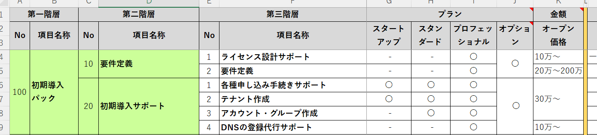
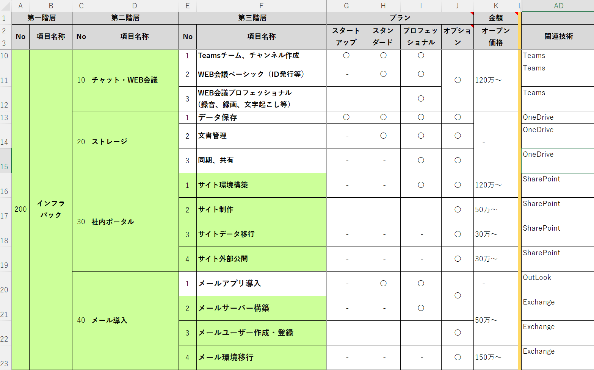
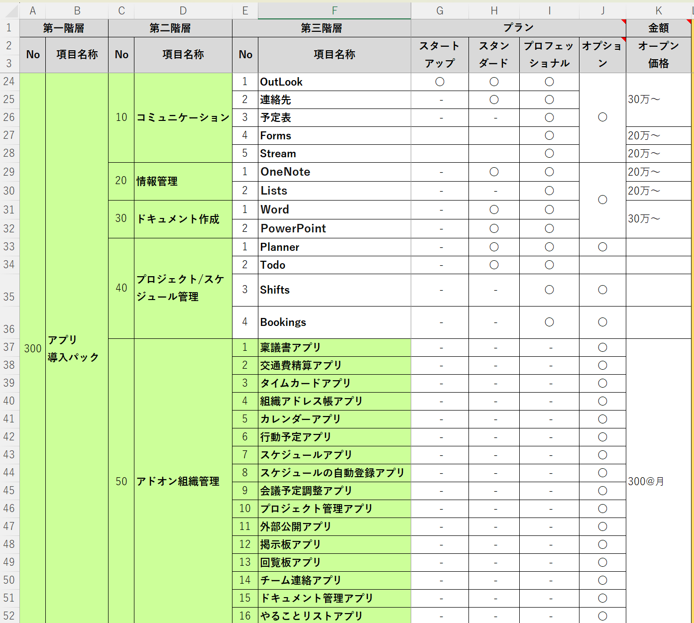

# 販売促進デモ一覧リスト

## 全体概要

### [事業戦略](716_M365_01_事業戦略FW.md)

## 100_初期導入パック

### [初期導入の流れの簡単な説明](716_M365_10_販売促進デモ一覧100_初期導入の流れ.md)

## 200_インフラパック

## インフラパックのアピールポイント

### [親和性の高さ](716_M365_10_販売促進デモ一覧02_親和性の高さ.md)

### [いつでもどこでもアクセス可能](716_M365_10_販売促進デモ一覧281_いつでもどこでもアクセス可能.md)

### [強力な検索機能](716_M365_10_販売促進デモ一覧03_強力な検索機能.md)

### [ドキュメントのバージョン管理機能](716_M365_10_販売促進デモ一覧04_バージョン管理.md)

## Teamsを用いたWEB会議とグループ機能

### [Teams](716_M365_10_販売促進デモ一覧11_Teams機能説明.md)

### [WEB会議](716_M365_10_販売促進デモ一覧283_WEB会議.md)

### [遠隔保守](716_M365_10_販売促進デモ一覧284_遠隔保守.md)

## オンラインストレージ

### [OneDrive](716_M365_10_販売促進デモ一覧51_OneDrive機能説明.md)

### [OneDriveのクラウドストレージ活用例](716_M365_10_販売促進デモ一覧295_OneDriveのクラウドストレージ活用例.md)

## SharePointを中心とした社内ポータル

### [SharePoint](716_M365_10_販売促進デモ一覧31_SharePoint機能説明.md)

### [SharePointとTeamsとの連携](716_M365_10_販売促進デモ一覧288_SharePointとTeamsとの連携.md)

### [表形式のデータをListsデータベースで管理](716_M365_10_販売促進デモ一覧289_SharePointとその他機能との連携.md)

## メール導入

### [Exchange](716_M365_10_販売促進デモ一覧41_Exchanget機能説明.md)

### [メールサービスをExchangeに移行する例](716_M365_10_販売促進デモ一覧290_メールサービスをExchangeに移行する例.md)

### [各種グループ作成方法](716_M365_10_販売促進デモ一覧291_各種グループ作成方法.md)

### [メーリングリストを用いた各種メール配信の活用](716_M365_10_販売促進デモ一覧292_メーリングリストを用いた各種メール配信の活用.md)

### [会議室と備品を用いた予約管理](716_M365_10_販売促進デモ一覧293_会議室と備品を用いた予約管理.md)

### [メール処理の自動化と自動通知](716_M365_10_販売促進デモ一覧294_メール処理の自動化と自動通知.md)

## インフラパック連携デモ

### [同期と共有](716_M365_10_販売促進デモ一覧282_同期と共有.md)

### [Forms連携でM365ライセンスプランのヒアリング](716_M365_10_販売促進デモ一覧285_Forms連携でM365ライセンスプランのヒアリング.md)

### [OneNote連携で議事録作成](716_M365_10_販売促進デモ一覧286_OneNote連携で議事録作成.md)

### [Plannerでタスクの情報共有](716_M365_10_販売促進デモ一覧287_Plannerでタスクの情報共有.md)

## 300_アプリ導入パック

