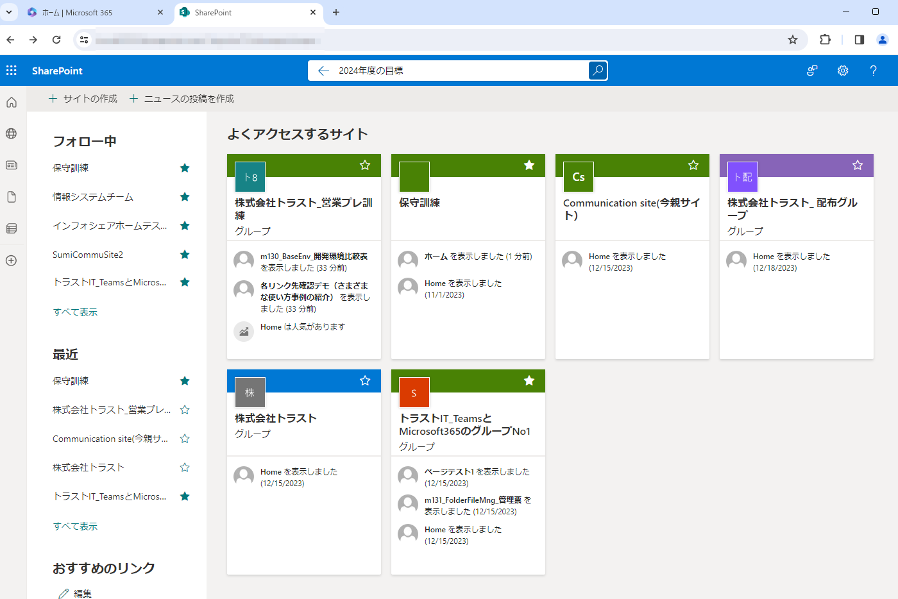
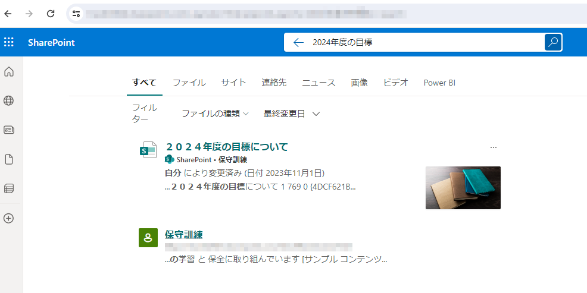
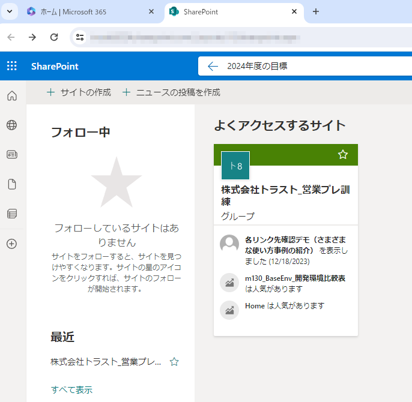
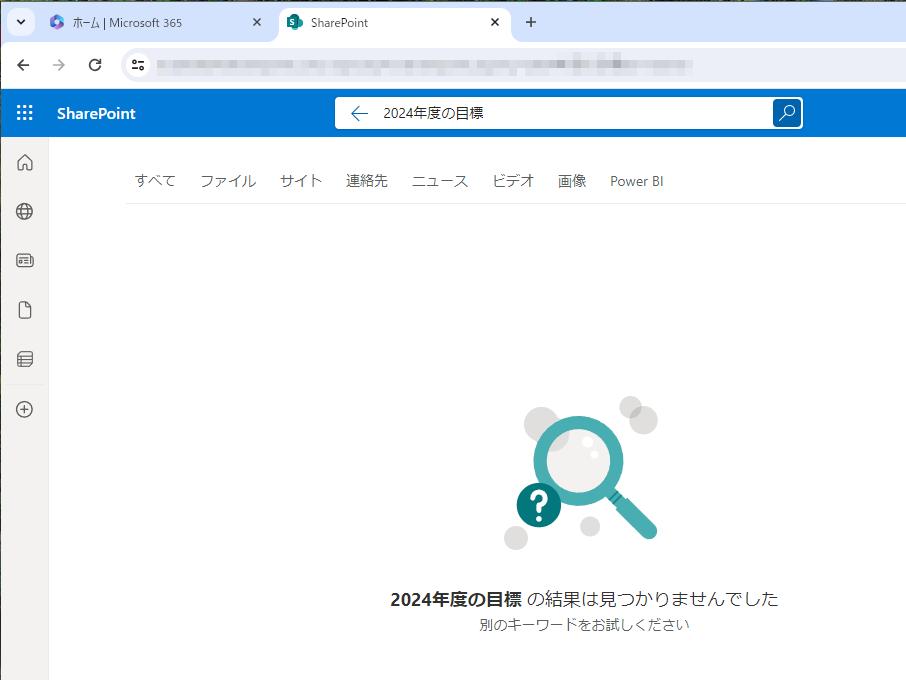
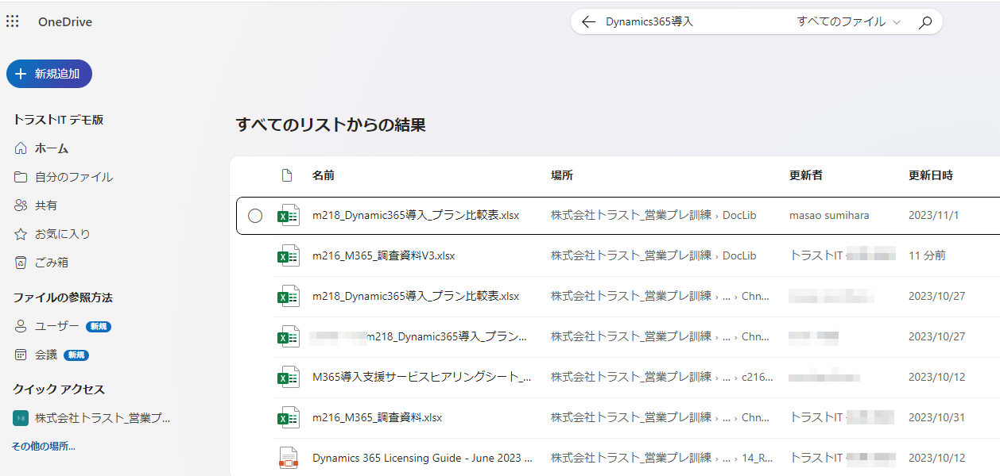
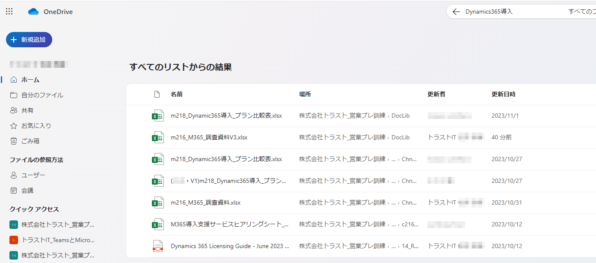
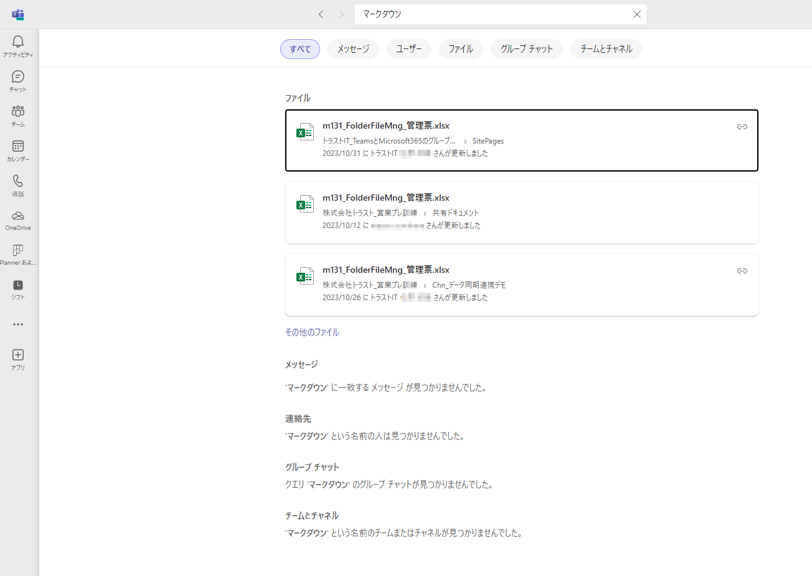

# 強力な検索機能

## 一般的な全文検索機能

　[様々なアプリケーションで作成したドキュメントの中のデータを全文検索する機能](716_M365_11_連携03_一般_各種検索.md)  

## Microsoft Search(検索機能)

一般的な全文検索と同じ能力をもったMicrosoft365の検索機能。

> [!IMPORTANT]
>
> - いつどもどこでもアクセス可能で、グループ間のメンバー共有も可能ですが、関係性のないユーザーは一切アクセスできないようにしています。またネット上で存在を検索できないようにしています。
> - 高信頼性: 災害にも強い

- ファイルサーバーでは簡単に実現できない検索能力。情報にすばやくたどり着くことが可能です。
- 検索機能の概要1: 参考図書265_239
- 参考資料1: 参考図書265_136
- 参考資料2: 参考図書265_221
- 絞り込み検索のコツ1: 参考図書265_240
- Teams内の情報をすばやく検索参考図書265_287
- [Microsoft Search 入門](https://blogs.windows.com/japan/2019/05/23/welcome-to-microsoft-search-intelligent-search-for-the-modern/)
- 検索設定のカスタマイズも可能

### 検索とセキュリティのコラボ

> [!IMPORTANT]  
> **Microsoft Searchの検索機能とセキュリティを意識したアクセス権により、**  
> **SharePointの検索機能は必ずアクセス権限を反映し、たとえ検索範囲が広がったとしても、ユーザーにアクセス権限のないサイトやファイルなどのコンテンツは検索結果から除外します。**  
> **単なる全文検索でなく、セキュリティ面も強化。この2点の特徴は他にない強みです。**  

### アプリケーション単位

#### SharePoint

- [SharePoint Online の検索機能](https://www.yrl.com/support/mscloud/info/2022/20220812-2.html)
- [SharePointの検索は検索を開始する場所によって検索範囲が異なります](https://shanqiai.lekumo.biz/sharepoint_technical_note/2023/05/sharepoint-1cf9.html)

#### OneDrive

- [OneDriveではファイルの中身の検索もできてメチャクチャ便利](https://www.sukicomi.net/2015/05/onedrive-officesearch.html)

#### Teams

- [Teamsのチーム検索・整理方法(YouTube)](https://www.youtube.com/watch?v=qOxvlA5GeaQ)
- [Teamsチャット検索機能大全集(YouTube)](https://app.researchr.work/researchrblog/teams-search)

### 高度な検索機能

#### Microsoft Pureviewでの検索機能

上位のライセンスを利用した場合、プログラムからの自動検索や幅広い検索方法に対応。

- [コンテンツ検索の概要](https://learn.microsoft.com/ja-jp/purview/ediscovery-content-search)

---

## デモサンプル例

### デモ画像

---

#### 10_SharePointの検索(アクセス権の違いにより検索結果が異なるパターン)

> [!NOTE]
> 11:SharePointで全文検索するときのケース。とくに設定しなくてもアクセス権に応じて自動で検索範囲が変わります。

　12:異なるユーザーで検索したときの結果。アクセス権のないファイルは検索してもヒットしません。

---

#### 20_OneDriveの検索(同じアクセス権で検索結果が同じパターン)

> [!NOTE]
> 21:OneDriveで全文検索するときのケース。

　22:異なるユーザーで検索したときの結果。アクセス権の範囲が同じため、同じ検索結果です。

---

#### 30_Teamsの検索

> [!NOTE]
> 31:Teamsで全文検索するときのケース。

## 引用文献

> 参考図書265_239:「Microsoft 365 SharePoint運用管理編」の678ページ、日経BP、2021、平野愛  
> 参考図書265_136:「ひと目でわかるMicrosoft 365 ビジネス活用編」の205ページ、日経BP、2022、西岡 真樹 他  
> 参考図書265_221:「Microsoft 365 SharePoint運用管理編」の42ページ、日経BP、2021、平野愛  
> 参考図書265_240:「Microsoft 365 SharePoint運用管理編」の693ページ、日経BP、2021、平野愛  
> 参考図書265_287:「Teams仕事術」の77ページ、技術評論社、2022、椎野磨美  
> 参考図書265_134:「ひと目でわかるMicrosoft 365 ビジネス活用編」の172ページ、日経BP、2022、西岡 真樹 他  
