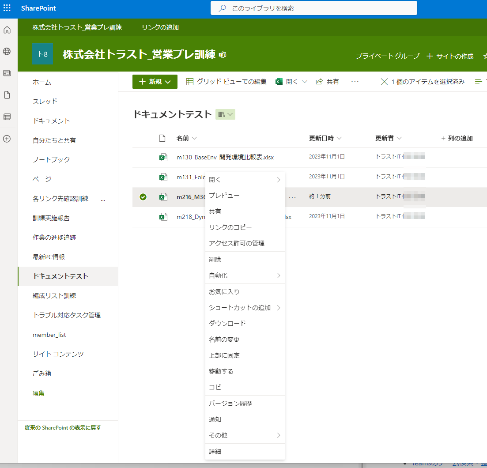
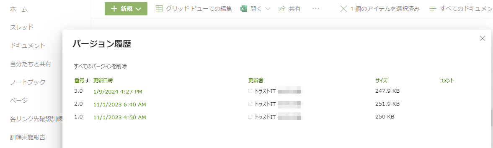
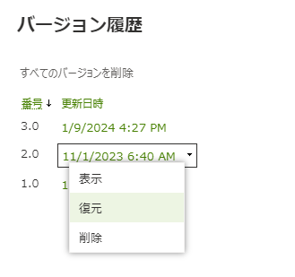
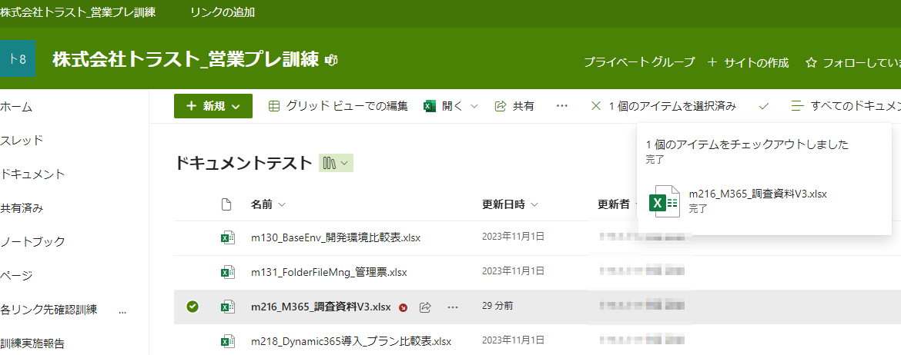
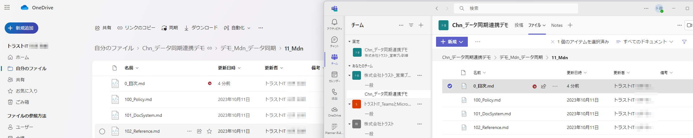
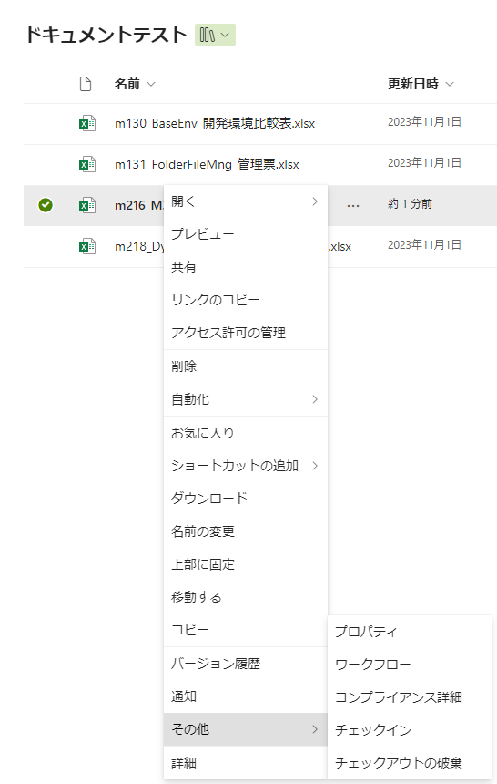
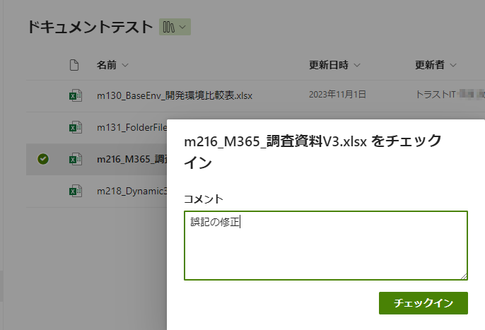
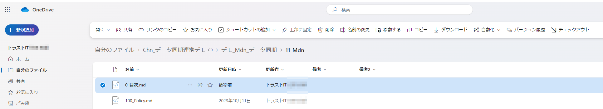
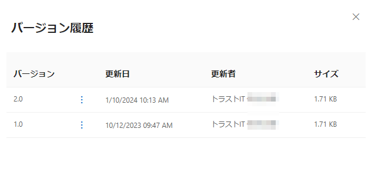
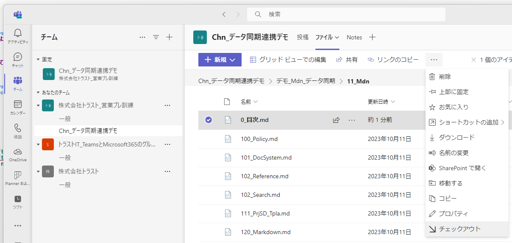

# バージョン管理

## 概要

Gitなどの高度なバージョン管理を必要としない、グループ間での共同編集に適した簡潔なバージョン管理機能を提供します。

- 概要2 参考図書265_201
- 概要3 参考図書265_223>  

## 特徴

### 自動バージョン管理

> [!IMPORTANT]  
> 文書が変更されるたびに、自動的に新しいバージョンを作成します。

### バージョン履歴の表示

> [!IMPORTANT]  
> バージョン履歴を閲覧し、特定のバージョンの詳細(変更された日付、変更者、変更内容など)を確認ができます。

### 以前のバージョンへの復元

> [!IMPORTANT]  
> 過去のバージョンを現在のバージョンとして復元することができます。これにより、誤って行われた変更や不要な編集を元に戻すことが可能です。

### チェックアウトとチェックインの概念

バージョン管理系のアプリで一般に用いるチェックアウト、チェックイン機能のサポートを行います。  
**同時編集可能だが、同時に編集できる人を一人だけに限定することも可能**

### メジャーバージョンとマイナーバージョン参考図書265_203

メジャーバージョン: 正式な公開バージョンであり、整数値で表します(1.0、2.0、3.0など)。通常、ユーザーが利用するのはこのメジャーバージョンです。  
マイナーバージョン: 下書きバージョンであり、小数点以下で表します。(1.2など)共同編集者以外は原則非公開とします。  

### 一般的なファイルサーバー管理との比較

- ファイルの履歴管理と同時編集が可能です。
- 複数人による同時編集が可能です。
  - **クラウド環境を利用することで、ファイルサーバー上では実現不可能なエクセルの共同編集などが可能です。**

## バージョン管理が可能な環境

### 自動的にバージョン管理が可能なクラウド環境

- SharePoint
- OndeDrive
- Teams

### 共同編集に対応しているファイル形式 参考図書265_143

SharePoint、OneDrive、Teams上にファイルを格納することによりバージョン管理が可能です。代表例として下記で保存したファイルなどがあります。

- Word
- PowerPoint
- Excel
- OneNote

---

## デモサンプル例

### デモ画像

#### 10_SharePointのバージョン管理機能

> [!NOTE]  
> 11:SharePoint上で格納したファイルのバージョンを確認する例です。確認するファイルを選択して、右クリックで「バージョン」履歴を選択します。

　12:今までの変更の一覧を確認できます。

　13:過去のバージョンに戻したいときは、戻したいバージョンを選択して、右クリックの「復元」から戻すことが可能です。

---

#### 20_チェックアウト、チェックイン

> [!NOTE]
> 21:ファイルの共同編集を禁止し、自分だけが編集可能な状態になるように排他制御することが可能です。

　22:チェックアウトが成功すると、ファイルの横にチェックアウト状態のアイコンを表示します。

　23:チェックアウトのときは同期、共有状態にある他のアプリからも、同じようにチェックアウト状態のアイコンで状態を確認できます。

　24:編集が完了すればチェックイン操作により、他の人が編集可能な状態へ変更します。

　25:コメントを記入することで、変更履歴にメモを残すことができます。

---

#### 30_OneDrive、Teamsのバージョン管理機能

> [!NOTE]  
> 31:OneDriveでバージョン履歴を確認する例です。

- [※シームレス](https://e-words.jp/w/%E3%82%B7%E3%83%BC%E3%83%A0%E3%83%AC%E3%82%B9.html)
- [※ユーザーエクスペリエンス](https://service.shiftinc.jp/column/4748/)

> 32:Temasでチェックアウトする例です。

## 引用文献

> 参考図書265_201:「ひと目でわかるMicrosoft 365 SharePoint運用管理編」の91ページ、日経BP、2021、平野愛  
> 参考図書265_203:「ひと目でわかるMicrosoft 365 SharePoint運用管理編」の383ページ、日経BP、2021、平野愛  
> 参考図書265_223:「ひと目でわかるMicrosoft 365 SharePoint運用管理編」の86ページ、日経BP、2021、平野愛  
