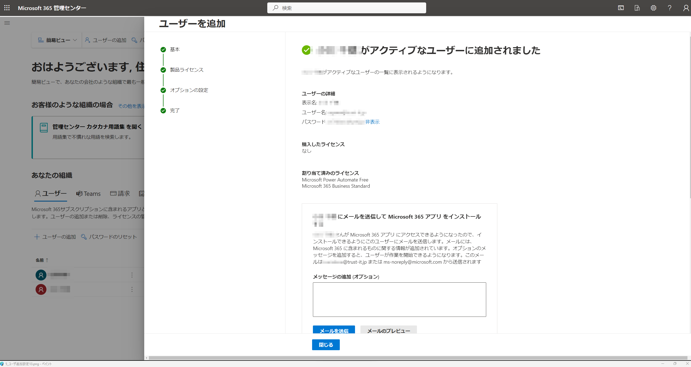
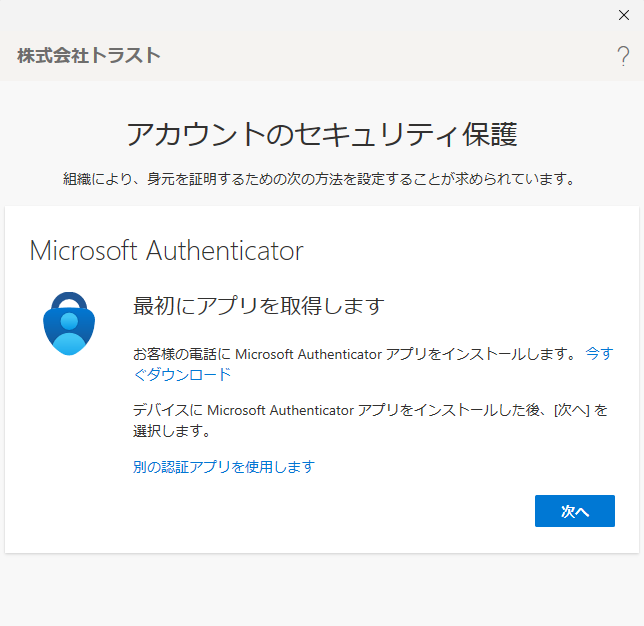
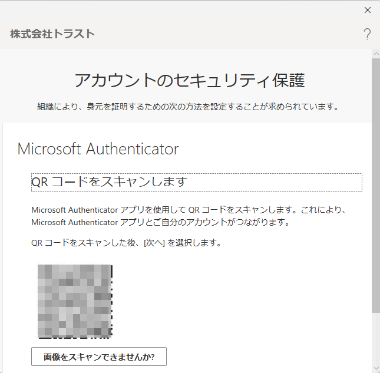

# 初期導入の流れ

## お客様に確認が必要な項目

### 導入直前にお知らせが必要な項目

1. ドメイン情報(新規か移行か)
2. テナント名の決定
3. ユーザー名の決定
4. 社内ポータルを導入するかどうか(SharePointをどこまで利用するか)

　[※ドメインとは](https://www.onamae.com/clever/about/domain.html)  

### 導入作業

1. テナントとドメイン名の設定参考図書265_027

### 導入後に確認していただく項目

1. Microsoft365へのサインイン方法参考図書265_011
1. 自身のプロファイル確認参考図書265_012
1. Officeデスクトップアプリのインストール参考図書265_013
1. インストールアプリの初回ライセンス認証参考図書265_014
1. スマートフォンへのアプリのインストール参考図書265_019
1. ライセンス課金情報の確認方法参考図書265_028
1. ユーザーの管理方法参考図書265_029
1. グループの管理方法参考図書265_031

### 保守がない場合のお客様に運用していただく必要がある項目

1. 退職時のユーザーアカウントの対応参考図書265_231

## テナント作成時のドメイン設定

### 初期ドメインの指定例

### カスタムドメインを設定する場合の例

**利便性を高めるため、会社で既に使用しているドメインやホームページで利用しているドメインを利用することも可能です。**  
他社からドメインを利用している場合は、必要に応じて他社のドメイン設定の変更するため注意しましょう。

---

## アカウント作成

### 作成方法説明手順

- [ライセンス付与手順(YouTube)](https://www.youtube.com/watch?v=x5fwOGyh_qQ)
- [ライセンス解除手順(YouTube)](https://www.youtube.com/watch?v=UdOeWZFmEVE)

### アカウント作成例

---

### 作成アカウントのライセンス割り当て

ライセンスを割り当てることで利用が可能になります。  
**通常は下記のようにアカウント作成と同時にライセンスを割り当てるので、ライセンスは購入済みの状態になっている必要があります**  
  

---

### アカウント作成後のライセンス割り当て

組織移動等により必要なライセンスを後から変更することも可能です。  

---

### 作成後のアカウント認証例

---

## グループ作成

### グループの概念

グループの概念の理解 参考図書265_137

#### 管理者としてグループ追加時に自動連係するアプリ

**自動作成・連携が実行されるため、Microsoft365導入のインフラ構築として、Teams、SharePoint、Exchange、Plannerのインフラ構築もできることが望ましいです。** 参考図書265_140

### グループの作成実例

グループ名「株式会社トラスト_営業プレ訓練」を作成するときの例を下図に示します。  

## 引用文献

> 参考図書265_013:「誰でもできる!Microsoft365導入ガイド」の21ページ、株式会社ネクストセット、2023、村上 宏樹  
> 参考図書265_014:「誰でもできる!Microsoft365導入ガイド」の23ページ、株式会社ネクストセット、2023、村上 宏樹  
> 参考図書265_019:「誰でもできる!Microsoft365導入ガイド」の100ページ、株式会社ネクストセット、2023、村上 宏樹  
> 参考図書265_137:「ひと目でわかるMicrosoft 365 ビジネス活用編」の208ページ、日経BP、2022、西岡 真樹他  
> 参考図書265_231:「Microsoft 365 SharePoint運用管理編」の608ページ、日経BP、2021、平野愛  
> 参考図書265_031:「誰でもできる!Microsoft365導入ガイド」の286ページ、株式会社ネクストセット、2023、村上 宏樹  
> 参考図書265_029:「誰でもできる!Microsoft365導入ガイド」の251ページ、株式会社ネクストセット、2023、村上 宏樹  
> 参考図書265_028:「誰でもできる!Microsoft365導入ガイド」の246ページ、株式会社ネクストセット、2023、村上 宏樹  
> 参考図書265_027:「誰でもできる!Microsoft365導入ガイド」の216ページ、株式会社ネクストセット、2023、村上 宏樹  
> 参考図書265_012:「誰でもできる!Microsoft365導入ガイド」の18ページ、株式会社ネクストセット、2023、村上 宏樹  
> 参考図書265_011:「誰でもできる!Microsoft365導入ガイド」の12ページ、株式会社ネクストセット、2023、村上 宏樹  
> 参考図書265_140:「Microsoft 365 SharePoint運用管理編」の19ページ、日経BP、2021、平野愛  
