# いつでもどこでもアクセス可能

## 内容

- クラウドと融合することによりいつでも、どこでも、どんな端末からでも操作や閲覧が可能です。
  - どんな端末でも
    - スマホ、タブレット、パソコン
  - どんなOSでも
    - Windows、Linux、Android、iOS、macOS
- ユーザー1ライセンスでパソコン、タブレット、スマホそれぞれ各5台ずつ、計15台利用可能です。

## モバイルアプリから参照するケース

パソコン以外からも簡単にアクセスが可能です。
WEB上からの操作以外にも、パソコン専用のアプリ、モバイル専用のアプリも用意しています。

- Android用Microsoft Officeアプリ:参考図書265_236
- OneDriveモバイルアプリ:参考図書265_232
- SharePointモバイルアプリ:参考図書265_233
- Microsoft Listsモバイルアプリ:参考図書265_234

## 具体的手順等の参考情報

- [アプリをスマホで使う方法とは](https://symphonict.nesic.co.jp/workingstyle/microsoft365/use-with-smartphone/)
- [スマホてTeamsを使う方法(Youtube)](https://www.youtube.com/watch?v=0Jjj5DUlGnY)
- [Web版Office](https://azby.fmworld.net/usage/closeup/20210217/)
- [Teamsをブラウザで使用する方法](https://www.pc-koubou.jp/magazine/58581)

---

## デモサンプル例

### デモ画像

#### 10_自分のスケジュールをパソコン上とスマホ上でそれぞれ確認する例

> [!NOTE]  
> 10:会社のデスクトップパソコン上からも、外出中にスマホからも自分のスケジュールを確認する例

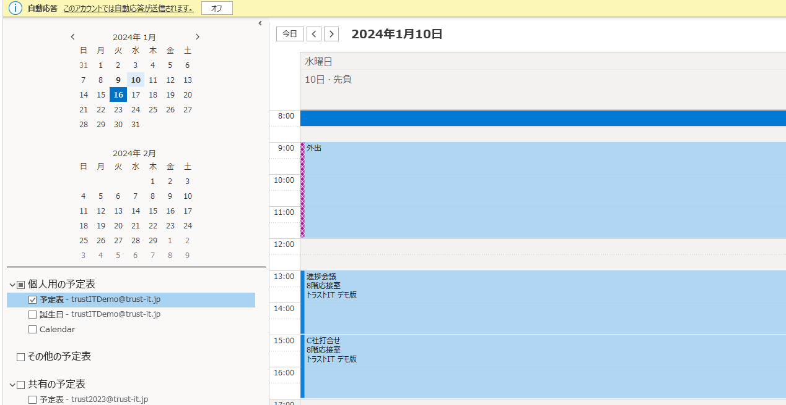

　　　11:同じスケジュールをスマホのOutLookアプリで確認した場合のケース。  

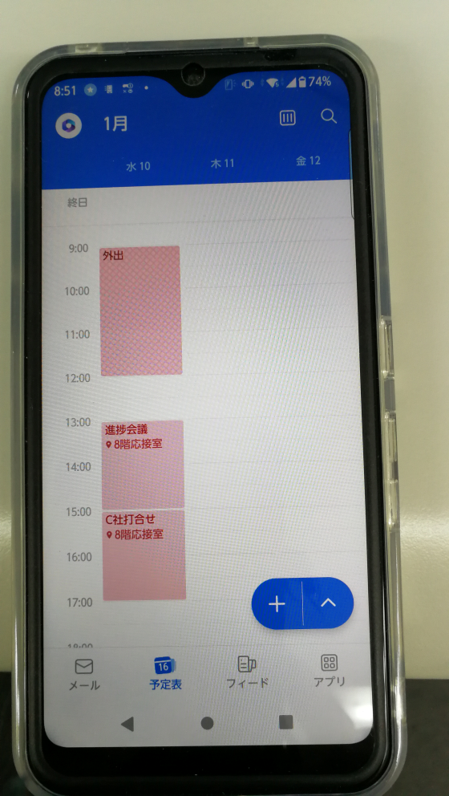

　　　12:同じスケジュールをスマホに入った別のアプリのTeamsアプリで確認した場合のケース。  

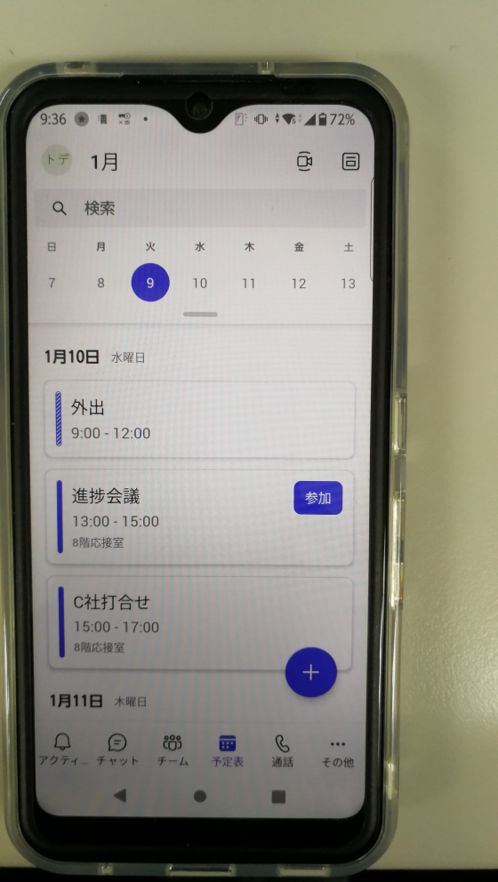

---

#### 20_自分のパソコンで管理している連絡帳をスマホ上のアプリで確認する例

> [!NOTE]  
> 20:スマホの連絡先アプリと自動連係することで、手動で連絡先を登録しなくても連絡先を確認することが可能です。

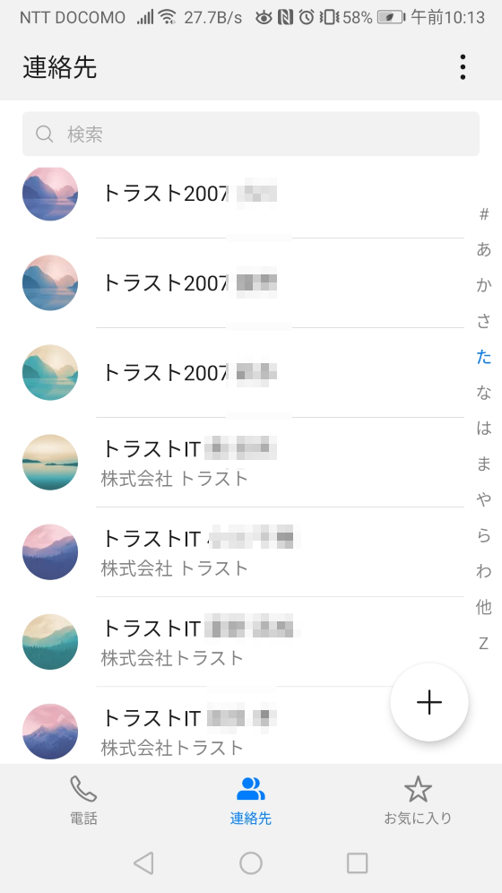

　　　21:同じ連絡先をスマホで別のアプリであるTeamsアプリで確認した場合のケース。  

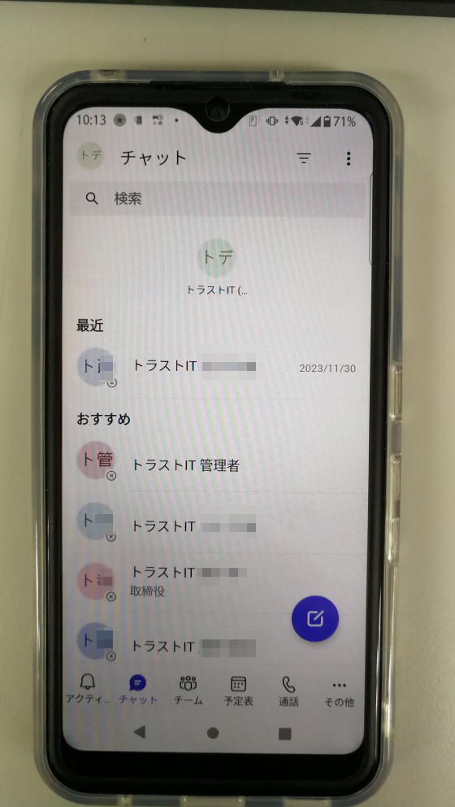

---

#### 30_自分のやることをToDoアプリで確認

> [!NOTE]  
> 30:ToDoアプリを用いて自分のデスクトップやWEB画面およびスマホアプリなどからいつでも確認することが可能です。

　　　31:やることリストをパソコン上のOutLookアプリから確認するケース。  

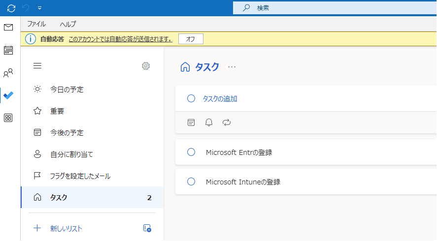

　　　32:パソコン上のWEB版のToDoリストアプリから確認するケース。  

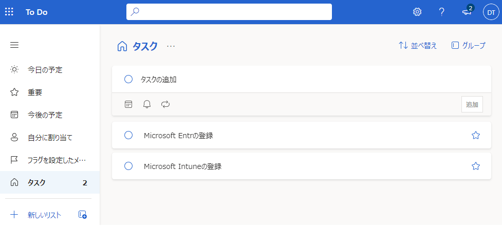

　　　32:スマホ上のTemas経由のPlannerアプリから確認するケース。  

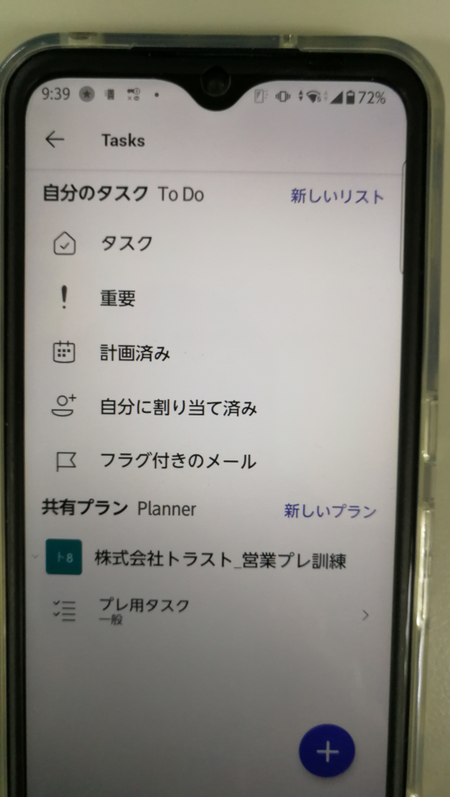

---

#### 40_チームのやることをPlannerアプリでさまざまな場面から確認

> [!NOTE]  
> 40:Plannerアプリを用いてチームのメンバのやることリストを様々な方法でいつでも確認することが可能です。

　　　41:パソコン上のWEB版のPlannerアプリから確認するケース。  

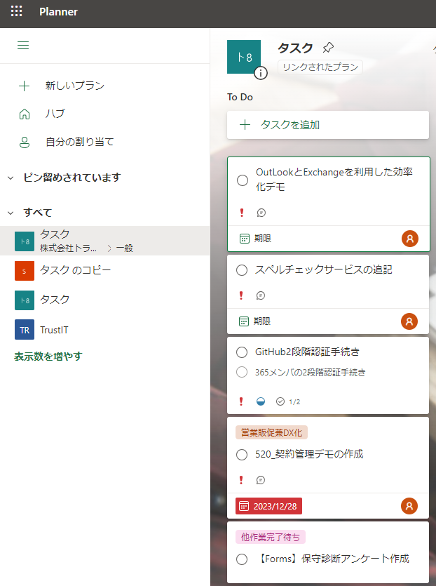

　　　42:タスクバーのOneDriveのアイコンから同期状態かどうか確認も可能です。  

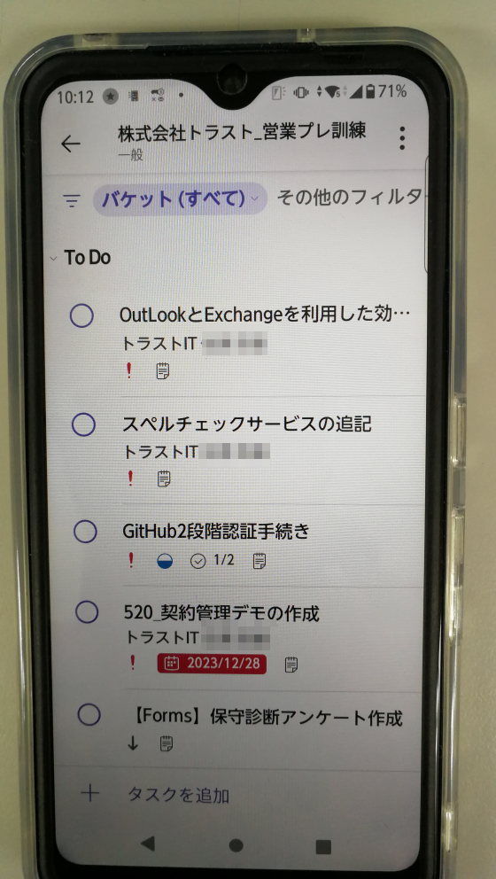

---

#### 50_SharePointのポータルサイトやデータベースをいつでもどこでも確認

> [!NOTE]  
> 50:ホームページを見るのと同じ感覚で、ポータルサイトやデータベースの登録情報を参照することが可能です

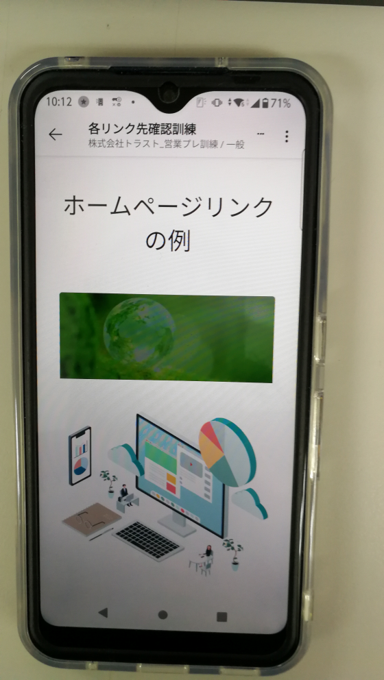
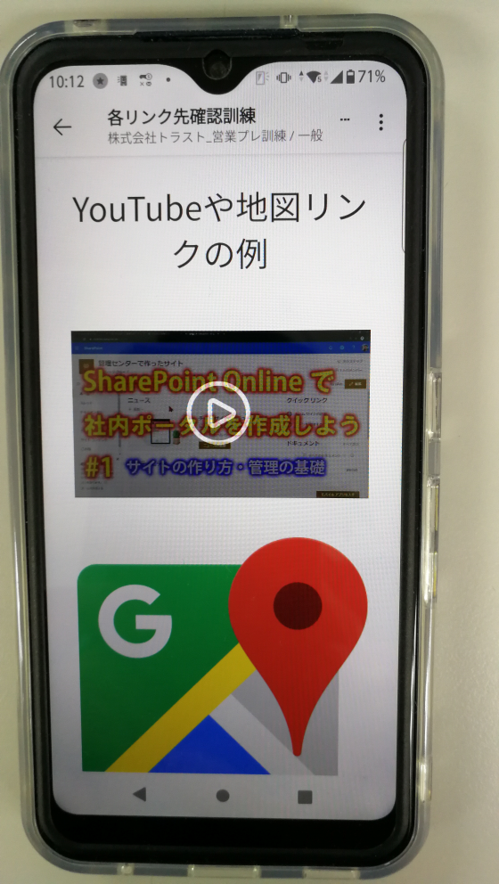
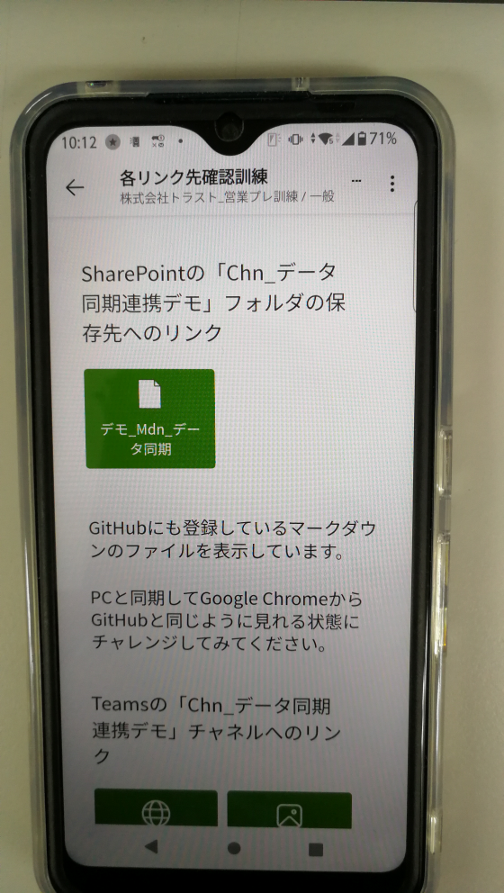

---

#### 60_スマホ上からPC上のメールを参照

> [!NOTE]  
> 60:いつもはパソコン上から確認するメールを、外出中にスマホからメールを確認できます。

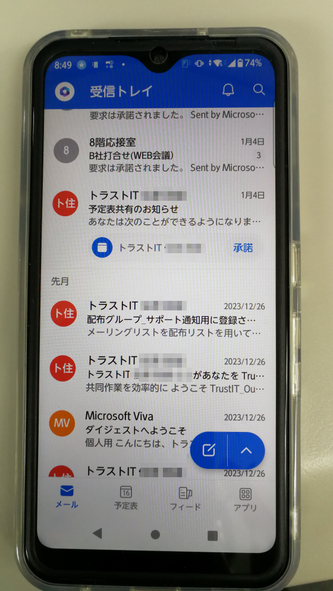

## 引用文献

> 参考図書265_236:「Microsoft 365 SharePoint運用管理編」の628ページ、日経BP、2021、平野愛  
> 参考図書265_233:「Microsoft 365 SharePoint運用管理編」の612ページ、日経BP、2021、平野愛 「ひと目でわかるMicrosoft 365 ビジネス活用編」の276ページ、日経BP、2022、西岡 真樹他  
> 参考図書265_232:「Microsoft 365 SharePoint運用管理編」の602ページ、日経BP、2021、平野愛  
> 参考図書265_234:「Microsoft 365 SharePoint運用管理編」の621ページ、日経BP、2021、平野愛  
