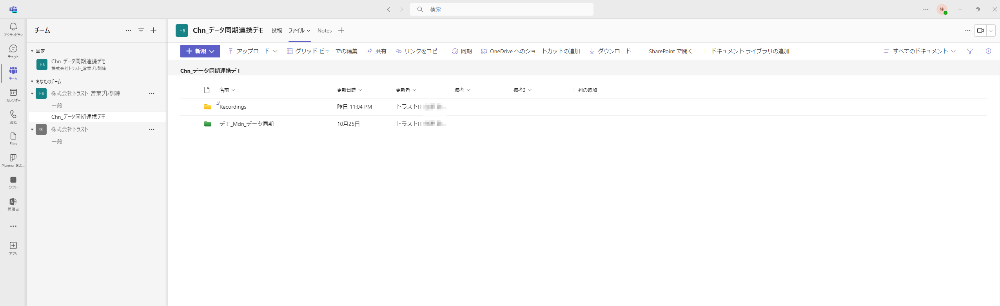
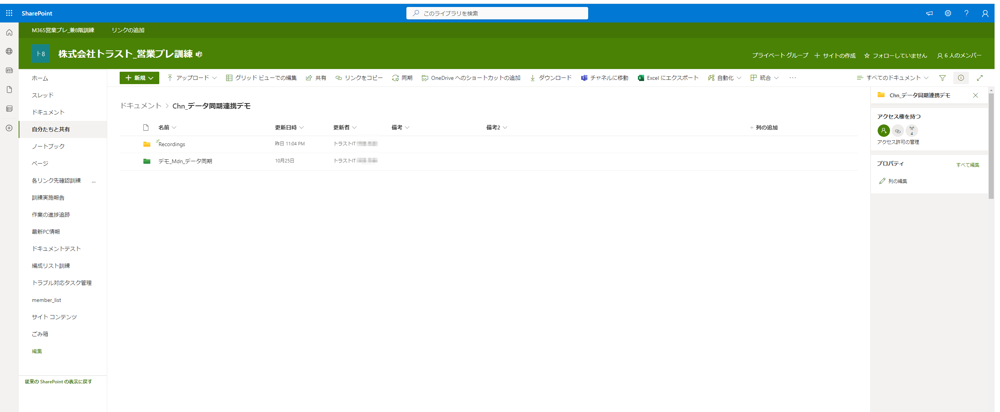
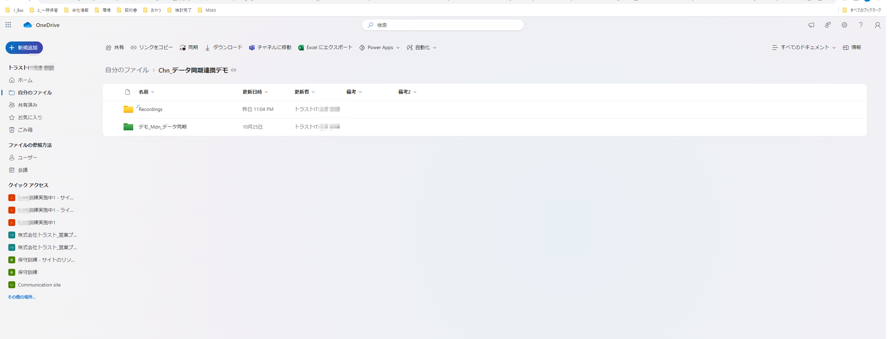
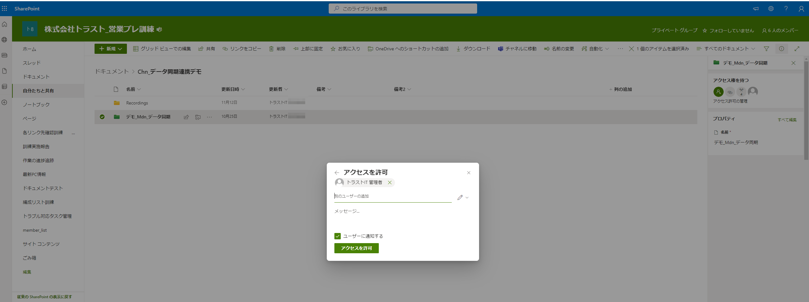
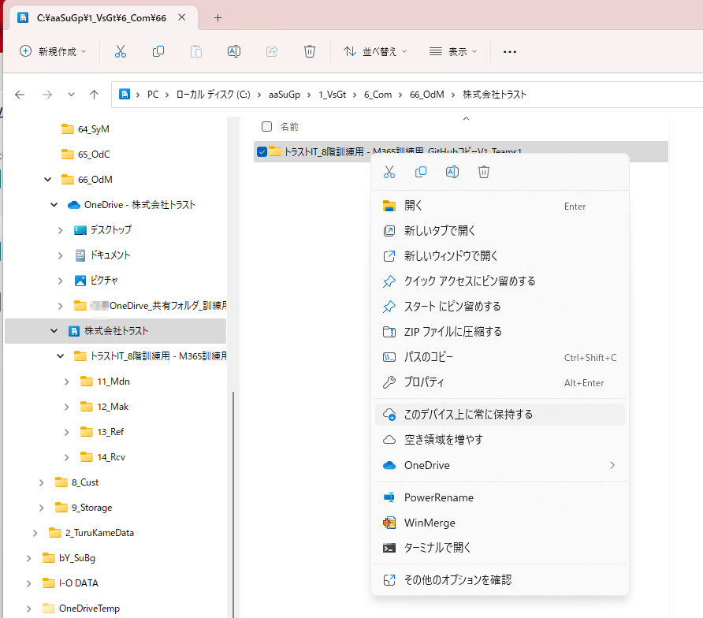
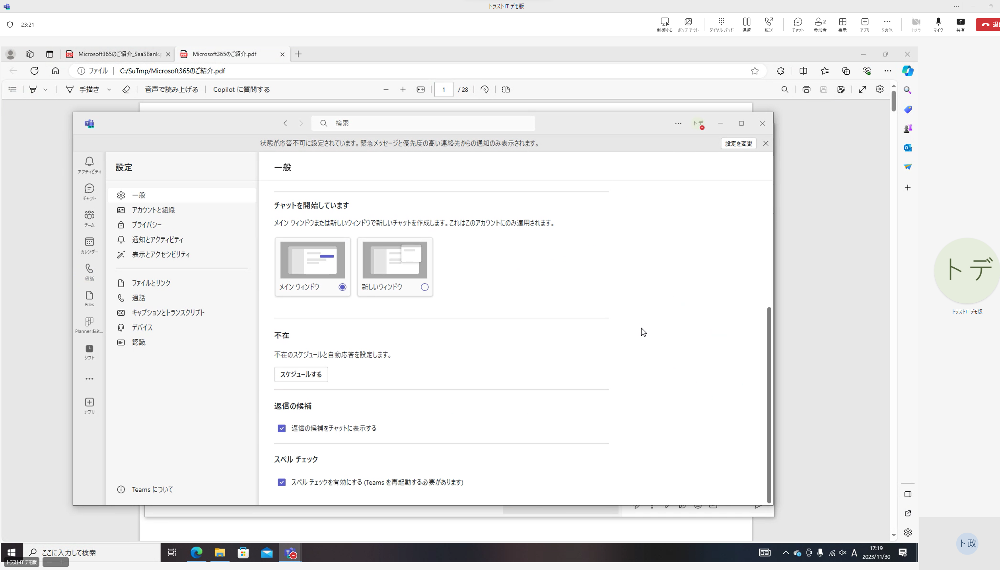

# 同期と共有

## 内容

簡単にメンバー間で情報共有できることを確認。  
すべてを見せる必要はないため、代表例としてOneDrive、Teams、SharePointを使います。状況に応じて、予定表など別の機能を用いて利用しても良いでしょう。  

## 詳細

- **同期と共有の機能を利用して、グループメンバー間での情報共有が可能です。**
- 開発者目線:ファミリープランとの違いの一番は、セキュリティ性を担保した上でのメンバー間の情報共有のしやすさです。
- グループウェアとしてのデファクトスタンダード

## 具体的手順等の参考情報

### TeamsとSharePointとOneDriveを同期

- **TeamsとOneDriveの同期方法** 参考図書265_170
- **TeamsとSharePointの関係を把握** 参考図書265_238
- [TeamsとSharePoint連携の参考例1](https://www.illuminate-j.jp/blog/teamstips2)

### TeamsやSharePointやOneDriveのファイルをPCと同期

- ローカルフォルダーとの同期機能1:参考図書265_021
- ローカルフォルダーとの同期機能2 参考図書265_131>:
- **ローカルPCのバックアップ** 参考図書265_228>:
- **ファイルオンデマンド機能** 参考図書265_229>:
- OneDrive同期クライアントツール参考図書265_353

- **OneDrive同期アプリを使おう** 参考図書265_227>:
- [**WindowsでOneDriveの新しい同期クライアントの使用を開始する1**](https://www.microsoft.com/ja-jp/biz/smb/column-onedrive-sync-feature.aspx)
- **WindowsでOneDriveの新しい同期クライアントの使用を開始する2**参考図書265_354
- [パソコンと同期手順と使い方　SharePointは共有フォルダのように使える(YouTube)](https://www.youtube.com/watch?v=a0DCayZBSLg&t=467s)
- [5分で学ぶOneDriveforBusiness基礎講座_TeamsやSharePointのファイルをローカルに同期_ファイルサーバ感覚で利用する方法(YouTube)](https://www.youtube.com/watch?v=LP2VQ8i6yUs)

### 同期の停止

- [デメリット_OneDrive同期解除_強制同期を解除して快適な状態にもどそう(YouTube)](https://www.youtube.com/watch?v=WPQ5EjutFNE)
- [OneDriveのファイル同期解除方法。メリット・デメリットも](https://yourclip.life/post/about-onedrive-cancel-synchronization/)
- 同期を一時的に停止 参考図書265_230>:
- ローカルフォルダーとの同期機能1:参考図書265_021
- ローカルフォルダーとの同期機能2 参考図書265_131>:
個人でのファイル管理が主体。特定のユーザーにファイルごとやフォルダー単位での共有設定はできるのですが、大量のファイルを多くのユーザーに共有する用途には向きません。
(同期等でネットワークに負荷がかかり、処理が重くなる可能性もあるため。)

### 同期に関するトラブルシューティング

- [OneDriveの同期に関する問題を解決する](https://support.microsoft.com/ja-jp/office/onedrive-%E3%81%AE%E5%90%8C%E6%9C%9F%E3%81%AB%E9%96%A2%E3%81%99%E3%82%8B%E5%95%8F%E9%A1%8C%E3%82%92%E8%A7%A3%E6%B1%BA%E3%81%99%E3%82%8B-0899b115-05f7-45ec-95b2-e4cc8c4670b2)
- [OneDrive と SharePoint の制限事項と制約事項](https://support.microsoft.com/ja-jp/office/onedrive-%E3%81%A8-sharepoint-%E3%81%AE%E5%88%B6%E9%99%90%E4%BA%8B%E9%A0%85%E3%81%A8%E5%88%B6%E7%B4%84%E4%BA%8B%E9%A0%85-64883a5d-228e-48f5-b3d2-eb39e07630fa)

### 共有機能

- 概要2 参考図書265_222>  
- 概要3 参考図書265_226>  

### デモ画像

- トラストで実現しているマークダウンとGitHubを用いた情報管理の手法を、Microsoft365上でも実現できることで、多様な利用方法があることを実感いただきます。
- OneDirve、SharePoint、Teams、パソコンのフォルダーが同期して、どれかで変更したものが他からすべて反映されている仕組みの実現が可能です。

## 引用文献

> 参考図書265_021:「誰でもできる!Microsoft365導入ガイド」の128ページ、株式会社ネクストセット、2023、村上 宏樹  
> 参考図書265_131:「ひと目でわかるMicrosoft 365 ビジネス活用編」の90ページ、日経BP、2022、西岡 真樹他  
> 参考図書265_170:「ひと目でわかるMicrosoft 365 ビジネス活用編」の90ページ、日経BP、2022、西岡 真樹他  
> 参考図書265_222:「Microsoft 365 SharePoint運用管理編」の64ページ、日経BP、2021、平野愛  
> 参考図書265_226:「Microsoft 365 SharePoint運用管理編」の579ページ、日経BP、2021、平野愛  
> 参考図書265_227:「Microsoft 365 SharePoint運用管理編」の589ページ、日経BP、2021、平野愛  
> 参考図書265_228:「Microsoft 365 SharePoint運用管理編」の591ページ、日経BP、2021、平野愛  
> 参考図書265_229:「Microsoft 365 SharePoint運用管理編」の596ページ、日経BP、2021、平野愛  
> 参考図書265_230:「Microsoft 365 SharePoint運用管理編」の598ページ、日経BP、2021、平野愛  
> 参考図書265_238:「Microsoft 365 SharePoint運用管理編」の654ページ、日経BP、2021、平野愛  
> 参考図書265_353:「ひと目でわかるOffice導入・運用管理編の40ページ、日経BP、2018、平野愛他  
> 参考図書265_354:「ひと目でわかるOffice導入・運用管理編の43ページ、日経BP、2018、平野愛他  
