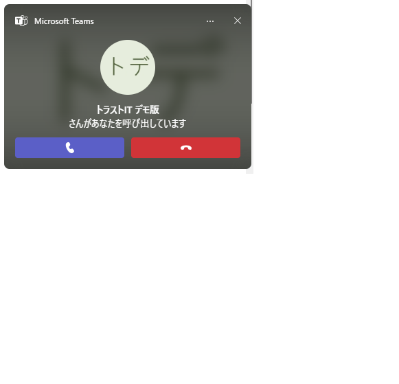
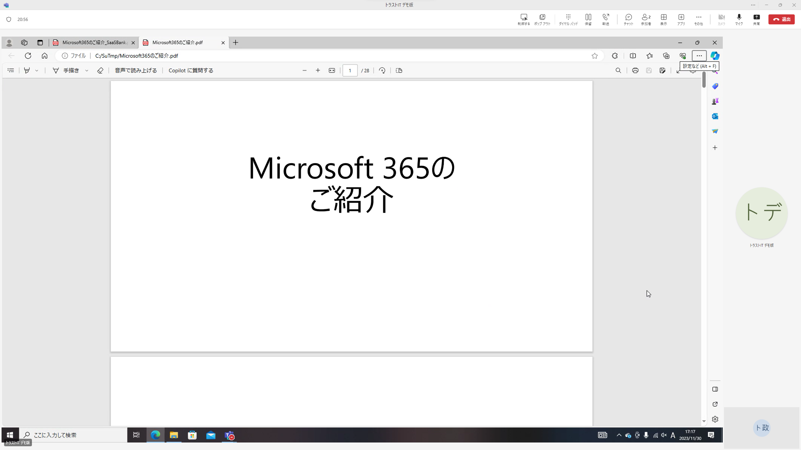
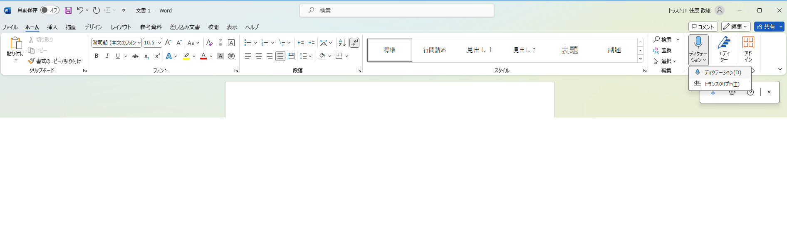
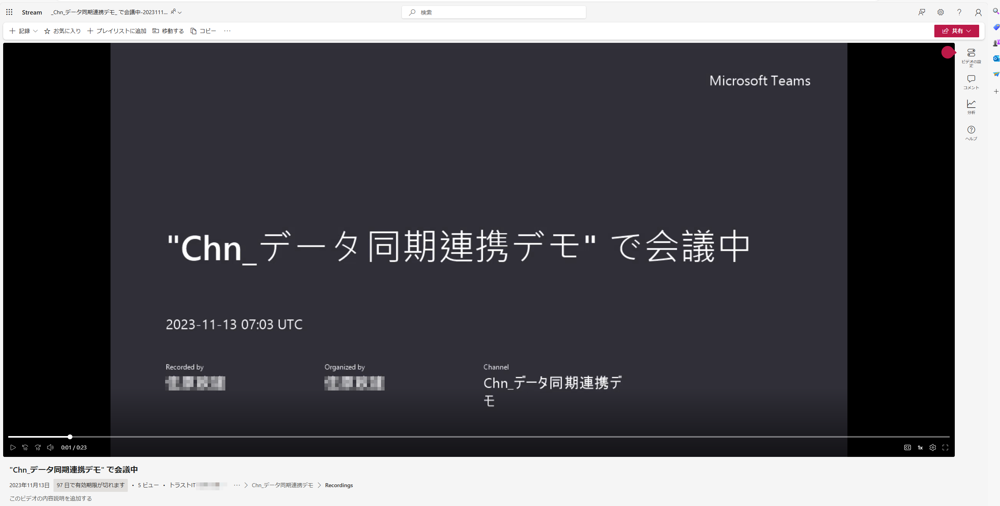
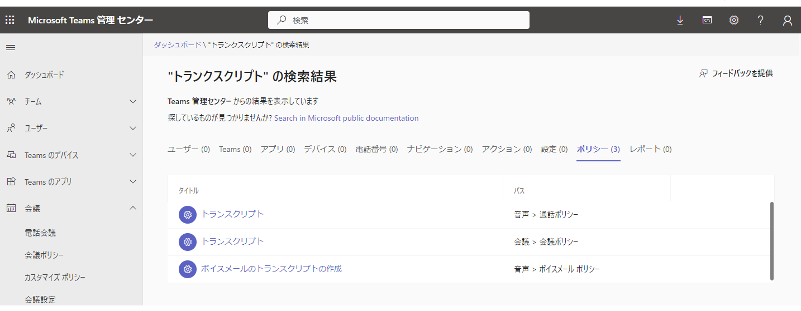

# WEB会議

## 内容

- Teamsを用いたWEB会議の実例を見ていただく。
  - パソコン、タブレット、スマホのどの端末を用いてもWEB会議が可能です。

## 詳細

- ネットワーク環境があれば、どこでも、いつでも以下ができます
  - 離れた相手との画面を通しての通話
  - WEB会議の開催案内
  - WEB会議の録画、文字起こし機能
  - 画面共有を利用したプレゼン
  - Lineと同じようなチャット機能

- WEB会議の付加機能もあることを、実際に以下のデモの例を紹介できるようにします
  - Teams上でのWEB会議の録画、文字起こし機能の確認
  - Wordを起動してのディクテーション、トランクスクリプト
- カスタマイズを実施すれば、文字起こしから議事録の自動作成の展開など、さらなる付加価値を提供できることを示します。
- WEB会議もいつでも、どこでも可能であること。一例: スマホとパソコンそれぞれにTeamsアプリをインストールしておけば、どちらにも同時に呼び出しが可能です。

## デモ画像

その場ですぐに相手を呼び出すケースです。  

Wordアプリと同じようにディクテーションやトランスクリプト機能を利用して、音声認識や文字おこしも可能です。  

会議の内容を録画し、再生することも可能です。  

