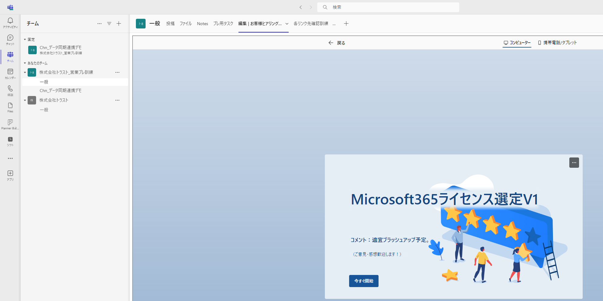
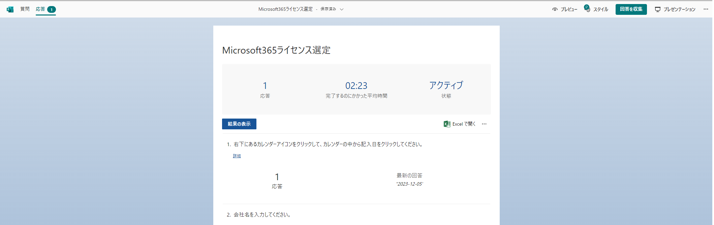
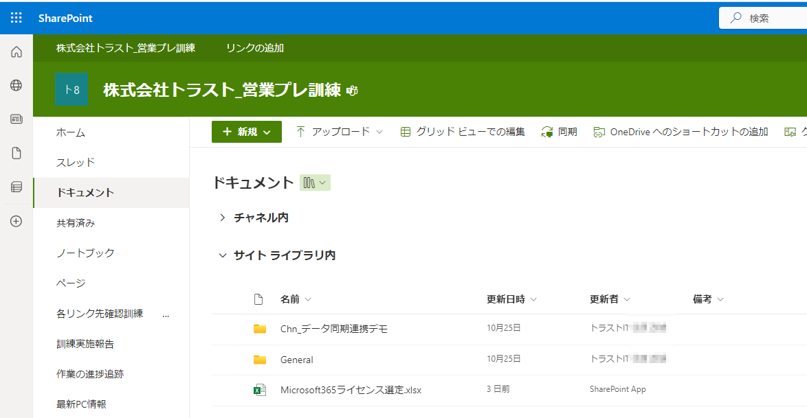
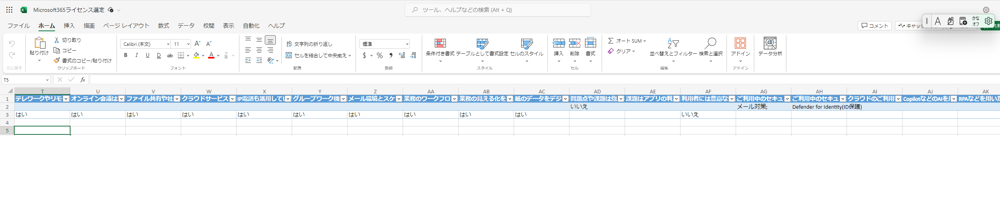
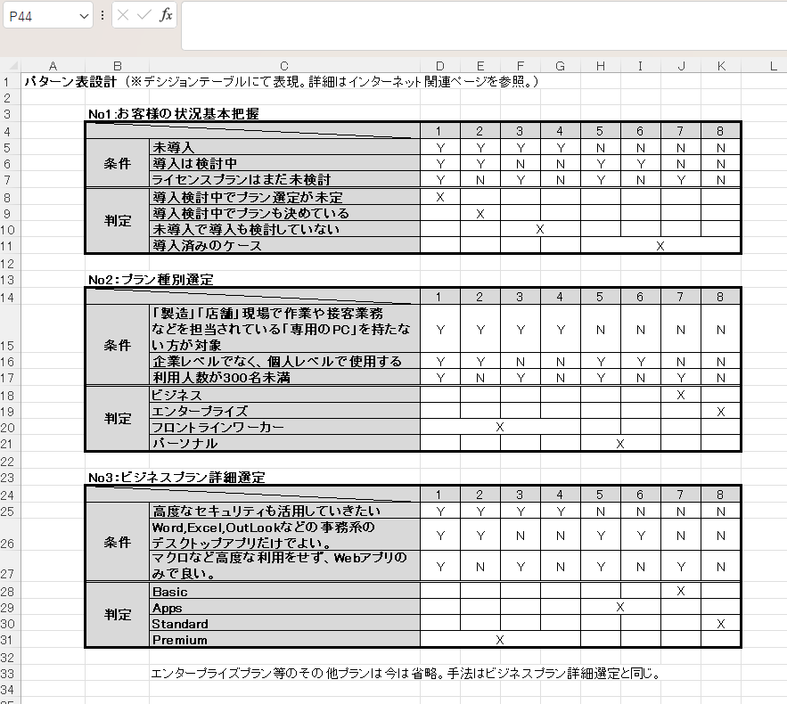
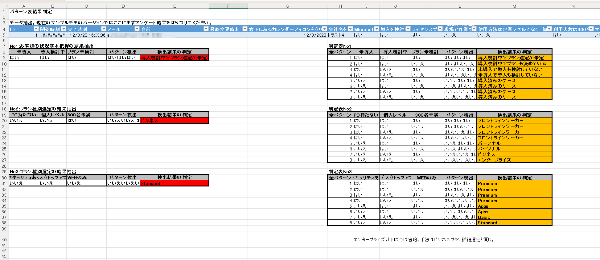
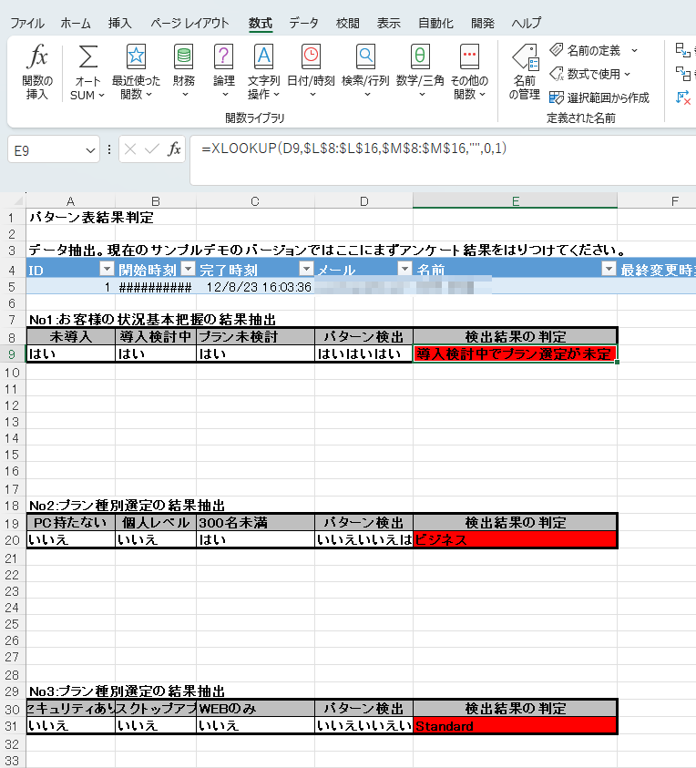
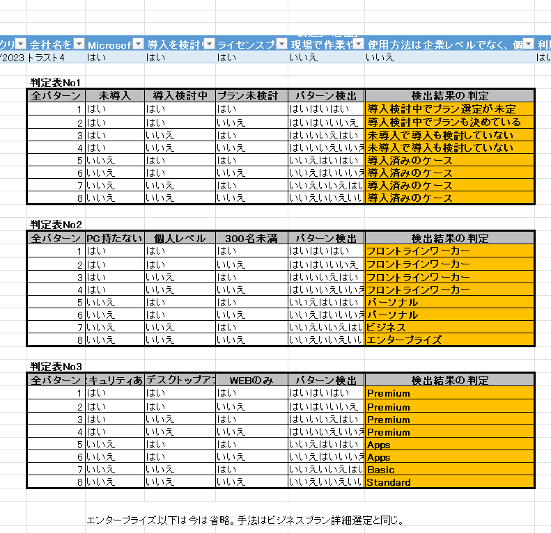

# Forms連携でMicrosoft365ライセンスプランのお客様ヒアリングリストの例

## 内容

- Microsoft365のライセンス選定をアンケート結果により自動算出するデモ。
- Microsoft Forms機能とExcelの関数を利用した集計結果の自動判定のデモ。
  - 本来ならアンケート結果は手動で、アンケート内容を確認し、手動で集計するために手間がかかります。
    - 本デモでは保存場所にSharePointの「株式会社トラスト_営業プレ訓練」チャネルにExcel形式で保存したケースを、エクセルの機能を利用してアンケート結果を自動判定します。

## 詳細

### 機能面

- [徹底解説 Microsoft Forms](https://www.jicoo.com/magazine/blog/microsoft-forms)
- アンケート作成との連携1参考図書265_273
- アンケート作成との連携2参考図書265_296
- Microsoft Formsを使用してフォームを作成する参考図書265_361

### メリット

- 単なるアンケートだけでなく、応用的な利用方法もあります。
- RPA的なサービスを付加できます。

### 使い方サンプル

- [Formsアンケート(YouTube)](https://www.youtube.com/watch?v=Cp1yf9tJNso)
- [マイクロソフトForms 連続分岐の仕方とセクションを使った問題解決法](https://econoshift.com/ja/ms-forms-branching/)

### 個別利用例

- [FormsでのIT勤怠管理](https://econoshift.com/ja/ms-forms-attendance-management/)

### アンケート結果の保存場所の指定が可能

- アンケートは1つ前の回答により、次の質問を切り替えることができるます。(デモの例ではSharePoint Online)
- 以下のことが可能です。
  - 保存場所の指定(デモの例ではSharePoint Online)
  - 保存方法の指定(デモの例ではExcel)
- クラウドに結果を保存することにより、いつどもどこでも、いろいろな方法で結果を確認できます。(デモの例ではTeamsからのリンク)
- Excelの関数やクラウドを組み合わせることにより、プログラムを用いなくても、アンケート結果の自動集計をする方法があります。
- アンケートをクラウド上に設置することにより、いつでも、どこでもアンケートに答えてもらえることが可能です。
- アンケート結果は2者選択の組み合わせがあるため、必要に応じて統計的な考え方が必要なケースになります。本デモではエクセル上でデシジョンテーブルを用いた方法を紹介しています。(詳細はインターネット関連ページを参照。）
- アンケート結果をデシジョンテーブルで設計するケースとエクセルの関数を用いたアンケート結果の自動判定例(デモではライセンス選定結果の判定)の例は下記エクセルを参照
  - [82_Forms_M365ライセンス選定判定](../../7_Prj/716_M365/300_アプリ/82_Forms/82_Forms_M365ライセンス選定判定.xlsx)  
- キーワードを自動的に拾い上げるワードクラウド機能へのインターフェイスも用意しており、AIを用いた解析への応用にも可能となっています。

### デモ動画

-[動画_ライセンス選定V1ケース](../../7_Prj/716_M365/300_アプリ/82_Forms/82_Formアンケート実施サンプル_V1ケース動画.mp4)  

### デモ画像

## 引用文献

> 参考図書265_273:「誰も教えてくれなかった!業務効率改善のためのMicrosoft Teams活用術」の152ページ、ダイヤモンド社、2023、山田榮一  
> 参考図書265_296:「Teams仕事術」の210ページ、技術評論社、2022、椎野磨美  
> 参考図書265_361:「ひと目でわかるOffice導入・運用管理編の134ページ、日経BP、2018、平野愛他  
