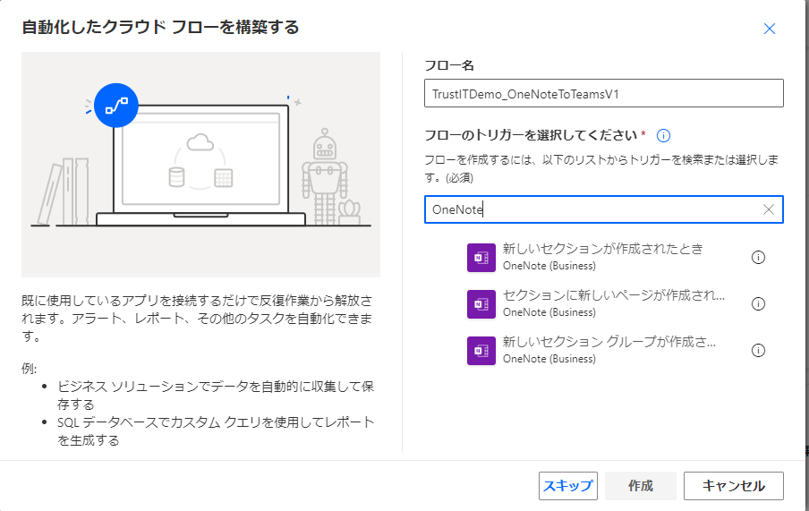

# OneNote連携で議事録作成

## 内容

- OneNoteの利用例として議事録のケースを取り上げます。
  - OneNoteは議事録作成のためのツールとしても人気があり、議事録のケースからOneNoteの機能を確認できます。

## 詳細

### 機能面

- ノートブック、セクション、ページという3層構造でデータを整理します。 参考図書265_401
  - ノートブック:1冊の大きなノート
  - セクション:ノートの中身が内容ごとに分割・カテゴライズします。
  - ページ:さらにその中に内容を書き込む1枚ずつのページがあります。
- OneNoteとTeamsの連携参考図書265_301
- ノート、セクション、ページを分けてテキストを整理参考図書265_302
- スペルチェックとオートコレクションオプションを使う参考図書265_303

### メリット

さまざまな連携方法や使い方があり、単なるメモアプリではなく応用サービスが可能です。

### 4階営業DX化関連

- 画像から文字を抽出する機能をサポートしており、アナログのデータをデジタルデータに自動変換するケースを紹介。DX化の促進が可能です。
- 4階営業の過去の訪問履歴をスキャンして、OneNoteに保存するケース。OCR機能と連携することでDX化の促進が可能です。

### 議事録関連機能

- [OneNoteで議事録を書こう](https://scilong.com/archives/973)
- [OneNoteで議事録を取れば仕事の精度が変わるっ!!(YouTube)](https://www.youtube.com/results?search_query=OneNote+%E8%AD%B0%E4%BA%8B%E9%8C%B2)
  

### 利用メリット

- 標準機能でTeamsやOutLookとの連携機能をサポートします。
- Teamsと連携することで、関係するチームやチャネル毎に情報をグループ化し、すばやく情報にたどり付けることができます。
- Microsoft Search機能の強力な検索機能を利用することが可能です。
- 音声を録音しながらメモを取るといったことが可能です。
- Outlookの「会議ノート」から、件名や日付、出席者などの情報をOneNoteに取り込む方法があるなど、議事録作成のための便利ツールが備わっています。
- 連携として標準の機能だけでなく、Power Automateを利用して、OneNoteを利用したカスタマイズ連携が可能です。
- OneNote単体で使用するだけなら、無料版での利用も可能です。

## デモサンプル例

- Power Automateを利用してOneNote上で議事録を新規作成したとき、Teamsに通知して、関連メンバーに作成のお知らせを自動通知するケースを紹介します。
- Outlookの予定の詳細画面にある「会議ノート」から、件名や日付、出席者などの情報をOneNoteに取り込むケースを紹介します。

### デモ動画

非公開。

### デモ画像

## 引用文献

> 参考図書265_302:「Teams仕事術」の234ページ、技術評論社、2022、椎野磨美  
> 参考図書265_303:「Teams仕事術」の238ページ、技術評論社、2022、椎野磨美  
> 参考図書265_301:「Teams仕事術」の231ページ、技術評論社、2022、椎野磨美  
