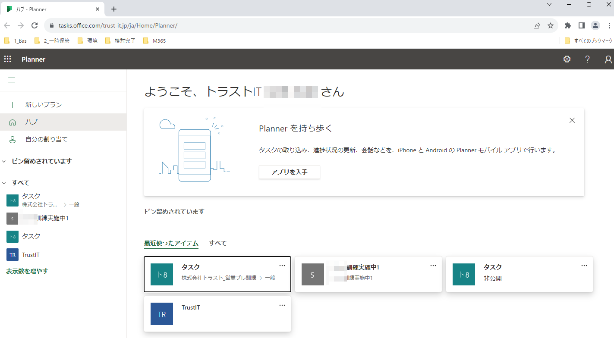
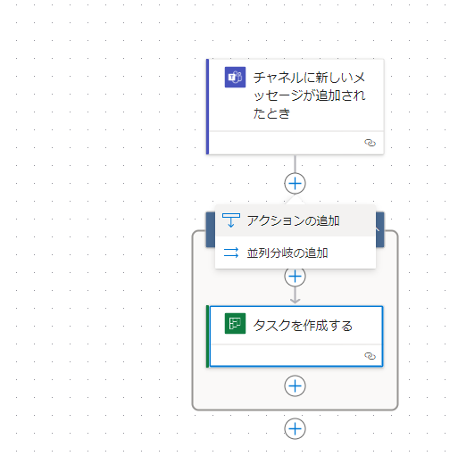

# Plannerでタスクの情報共有

## 内容

プロジェクト管理の1つであるタスクの管理は、Plannerアプリを用いるケースと、Plannerアプリから各アプリと連携するケースがあります。

## Microsoftのタスク管理ツール3選

- Planner:主にチーム単位でのタスクを管理するためのツール
- ToDo:主に個人単位でのタスクを管理するためのツール。
- Project:タスク管理とスケジュール管を組み合わせたツール。ビジネススタンダードプランには含まれていない。
  - 別途有償ですが、アクションプランに含まれているので、利用している場合はプランの範囲内での利用が可能。

## Planner

### 基本機能

- 「タブ」「バケット」「タスク」の3つの階層で情報を管理する構造になっています。参考図書265_299
- Teamsとの連携1参考図書265_298
- [新しい働き方で役立つMicrosoft Plannerとは](https://www.jbsvc.co.jp/useful/windows10/what-is-planner.html)
- [Plannerを使いこなそう！プランやバケットの追加方法](https://www.onamae-office.com/office365column/oaapp/planner_2/)
- Planner説明2参考図書265_359
- 標準機能でTeamsやOutLookとの連携機能をサポート。
- Teamsと連携することで、関係するチームやチャネル毎のタスクを管理して、すばやく情報にたどり付ける。
- フィルターを用いてタスクを並べ替えての表示ができます。

### メリット

- チーム業務の効率化や進捗管理も可能です。
- 標準で多くの連携機能があり、他のアプリとの親和性の高さがあります。

### デファクトスタンダードに準拠した表現方法

- アジャイル開発との親和性参考図書100_011
- アジャイル開発で用いたプロダクトバッグログおよびタスクボードに合った方式。 参考図書216_287_1>参考図書216_287_2
- [カンバンボードで用いた方式](https://miro.com/ja/agile/what-is-a-kanban-board/)
- [GitHubのProject機能との類似性](https://style.potepan.com/articles/33624.html)

### 連携機能

#### Plannerの自動リンク機能

- Teams:同じチームおよびチャネルのタスクをTeams上から確認。
- ToDo:個人タスク管理ツールのToDoで自分を割り当てたタスクを表示。
- スケジュール: 各タスクで設定した期間と期限をカレンダーから確認。
- Power Automateを利用してタスクの作成などのイベントを同じチーム内に通知。
- タスク完了などのイベントを関連メンバーにメールでお知らせ。

#### Plannerからその他アプリへのリンク

- ファイル: 同じグループ内で管理しているSharePointやOneDriveのファイルとリンク。
- ノートブック: 同じグループ内で管理しているOneNoteとリンク。
- サイト: 同じグループ内で管理しているSharePointのサイトとリンク
- プランをExcelへ出力: 登録しているタスク情報をExcelに出力。
- Outlookの予定表にプランを追加する: OutLookの予定表からタスク情報を確認。

#### 参考文献

- [PlannerのグループIDとプランIDを確認する方法](https://qiita.com/yamad365/items/481f82e8f0140a17d1e1)

## ToDo基本機能

- 機能紹介1参考図書265_017
- ToDoとTeamsの連携参考図書265_300
- ToDo説明2参考図書265_360

## デモサンプル例

### デモ動画

-[81_PLannerTodo1](../../7_Prj/716_M365/300_アプリ/81_PLannerTodo/81_PLannerTodo1.mp4)  

### デモ画像

---

> [!NOTE]
> メールの通知をONにする機能 

---

## 引用文献

> 参考図書216_287_1:「プロジェクトマネジメントの基本がこれ1冊でしっかり身につく本」の109ページ、株式会社技術評論社、2022、前田 和哉  
> 参考図書216_287_2:「システム設計とドキュメント」の189ページ、株式会社インプレス、2022、梅田弘之  
> 参考図書265_299:「Teams仕事術」の218ページ、技術評論社、2022、椎野磨美  
> 参考図書100_011:「システム設計とドキュメント」の189ページ、株式会社インプレス、2022、梅田弘之  
> 参考図書265_298:「Teams仕事術」の216ページ、技術評論社、2022、椎野磨美  
> 参考図書265_359:「ひと目でわかるOffice導入・運用管理編の95ページ、日経BP、2018、平野愛他  
> 参考図書265_360:「ひと目でわかるOffice導入・運用管理編の97ページ、日経BP、2018、平野愛他  
> 参考図書265_300:「Teams仕事術」の224ページ、技術評論社、2022、椎野磨美  
> 参考図書265_017:「誰でもできる!Microsoft365導入ガイド」の91ページ、株式会社ネクストセット、2023、村上 宏樹  
