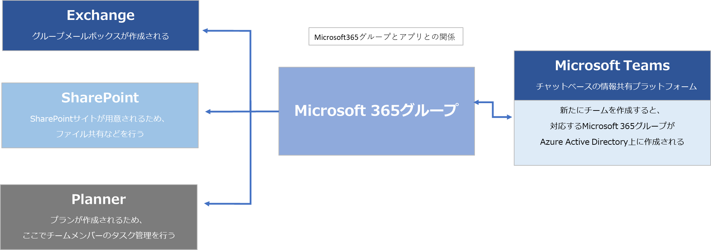

# SharePointとTeamsとの連携

## 内容

- 社内での情報共有のプラットフォームとして、SharePointが使用し理解すること。

## 詳細

- 社内同じMicrosoft365グループの場合、Teamsのデータ保存場所がSharePointであるという関係について。
- SharePointを理解することにより、Teamsでのファイルの保存場所や検索機能への理解が深まること。

### メリット

- 社内ポータルとしての利用価値。セキュリティに守られた、ホームページとは異なる利用方法。
  - 外出先等、いつども、どこでもアクセスできるが、ホームページとは違いセキュリティ面で許可を受けたユーザーのみアクセスできます。
    - 営業マンが、客先等でも必要なドキュメント等を使う際、社内のドキュメントにアクセスして提示することが可能です。
- アプリケーションで利用するファイルがバラバラでも、全ファイルを全文検索することができ、すばやく情報にたどりつける機能を有しています。

### TeamsとSharePointの連携と使い分け

#### 特徴

- [SharePointとMicrosoft Teamsの違いと連携方法をわかりやすく図解](https://notepm.jp/blog/11017)
- [知っていると得をする！SharepointとTeamsの違い・使い分け方法](https://akmemo.info/sharepoint-teams-differences/)

- **TeamsのデータはSharePoint またはOneDirveと連携して保存します。** 参考図書265_150>  
- 連携2参考図書265_297

#### 各コンテンツの保存先。(2022年7月時点)

|**コンテンツ名称**|**保存先**|
|:--|:--|
|ファイル|サイト上のドキュメントライブラリ上:［一般］‐［General］で表示|
|チームチャットの送付ファイル|サイト上のドキュメントライブラリ上: チャネルごとにフォルダーを作り、その中の直下に保存します|
|会議のレコーディング|OneDrive上の「Recordings」フォルダーに保存(以前はMicrosoft  Steamに保存していた時期もありました)|
|チャネル会議のレコーディング|サイト上のドキュメントライブラリ上: 各チャネルの「Recordings」フォルダー|
|プライベートチャット|チームのグループに含まれる各ユーザーのメールボックスの隠しフォルダー|
|標準チャネルチャット|チームのグループメールボックス|

**Teamsのチーム作成時に、SharePointのチームサイトも自動的に作成します。**  

Teamsには「SharePointで開く」というメニューもあります。  

チーム、グループでの情報共有という同じ用途があるものの、利用方法などが下図のように異なります。  

|**項目**|**Teams**|**SharePoint**|
|:--|:--|:--|
|共有する内容|ほぼリアルタイムでのチャット、会話中心|文書コンテンツ、フォーム情報ベース|
|共有する人|チームメンバー中心|サイトへのアクセス権限があるユーザー|
|情報量|PJに関連するすべての情報が集約|情報を種別ごとに整理して管理|
|情報粒度|細かい|粗め|

運用方法に以下の特徴があります。  

- Teams
  - リアルタイムかつ粒度が細かく動的な内容を共有します
  - プロジェクトを推進するため、起動しっぱなしの状態になります。
  - 会話レベルで何でもかんでも情報を集約させるため、時間が経過すると不要な情報が多すぎて、わかりにくくなります。
- SharePoint
  - ドキュメントなどの文書ファイルやリストのフォーム情報を中心に行います
  - SharePointは必要なときにアクセスして情報を得る形になるため、整理した情報を検索、閲覧に向いています。

## テンプレート

- [SharePoint_Microsoft_テンプレート集](https://lookbook.microsoft.com/)
- [テンプレートでSharePointポータルサイト作り方](https://echigoya-blog.net/sharepoint-site-template/)

## デモサンプル例

### デモ画像

## 引用文献

> 参考図書265_150:「ひと目でわかるMicrosoft 365 ビジネス活用編」の252ページ、日経BP、2022、西岡 真樹他  
> 参考図書265_297:「Teams仕事術」の214ページ、技術評論社、2022、椎野磨美  
