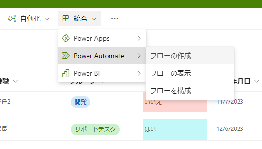

# SharePointとその他機能との連携

## 内容

- SharePointにはデータを表形式で保存するための手段として、データベースと連携する方法があり、Listsとの連携例を示します。

## 詳細

- Microsoft Searchを利用した全文検索がおこなえ、素早く情報を検索できます。
- フィルター条件を利用することにより、対象のデータを絞り込みができます。
- ListsやExcel、Power Automateなど多くの機能と連携ができます。

### メリット

- データベースと連携することで新しい価値、運用方法が可能です。
  - Listsの他にもExcelや本格的なデータベースであるDataVerseなど保存先を指定できることが理解できます。
- Excelと同じフィルター機能や入力規則など、Excelの専門知識がなくても、自動でフィルター条件を抽出できる機能などがあることが理解できます。

---

### Listsアプリ

- 概要5:参考図書265_235
- Microsoft ListsとSharePointリストの違い参考図書265_225

### 特徴

---

**既存のMicrosoft365が所有する情報を利用できます。(グループのアカウントを利用する例)**  

---

**列に特定の値のみの入力を許容する例。(リストから選択する例と管理画面）**  

---

**データ移行をするために、データを出力する場合の例**  

---

**RPA的な自動処理をプログラムなしで実施する場合の例**  

---

**フィルター機能を用いて必要な情報を検索する例**  

---

**データ更新時にメール通知でお知らせをするときの設定例**  

## テンプレート

- [SharePoint_Microsoft_テンプレート集](https://lookbook.microsoft.com/)
- [テンプレートでSharePointポータルサイト作り方](https://echigoya-blog.net/sharepoint-site-template/)

## デモサンプル例

### デモ画像

## 引用文献

> 参考図書265_225:「Microsoft 365 SharePoint運用管理編」の289ページ、日経BP、2021、平野愛  
> 参考図書265_235:「ひと目でわかるMicrosoft 365 ビジネス活用編」の162ページ、日経BP、2022、西岡 真樹他  
