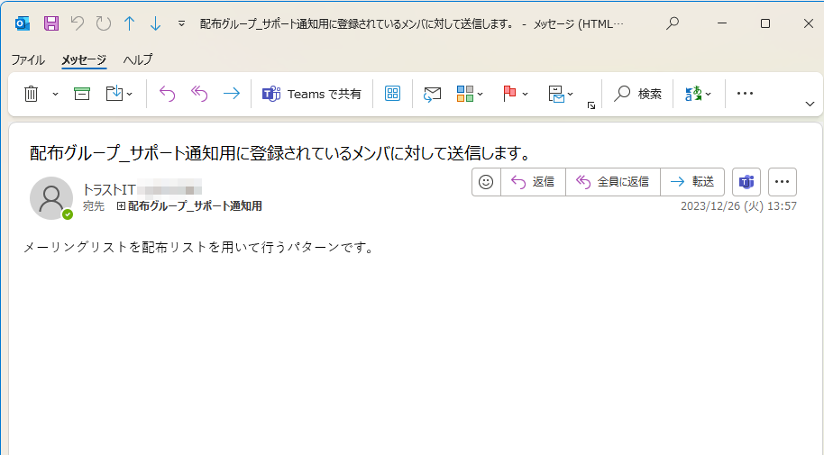
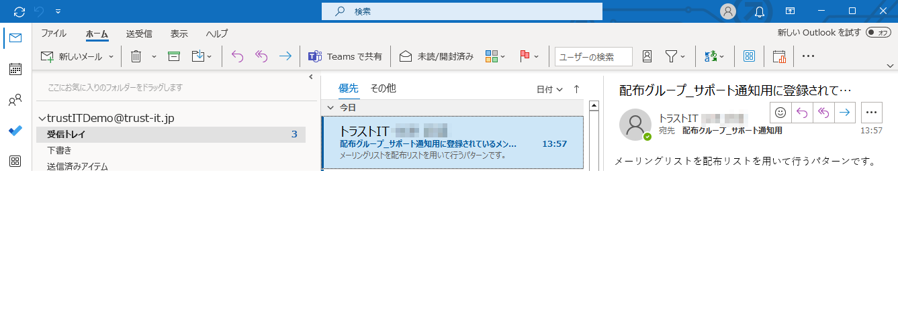
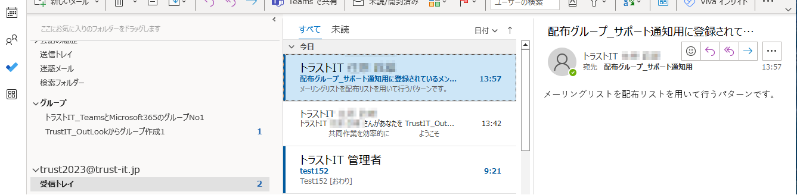
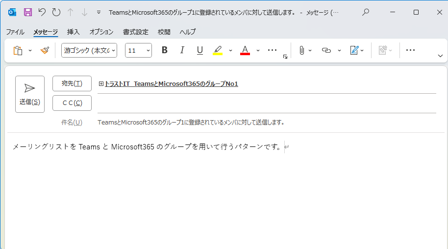
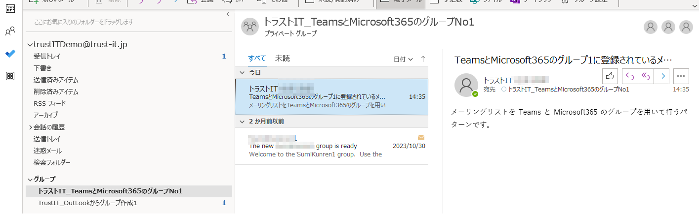
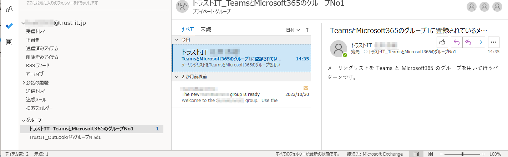
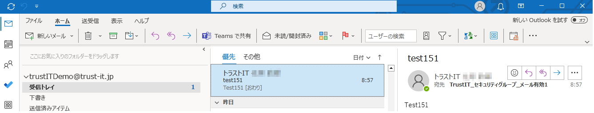
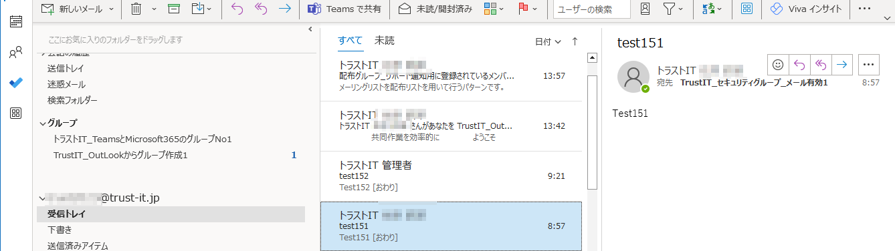
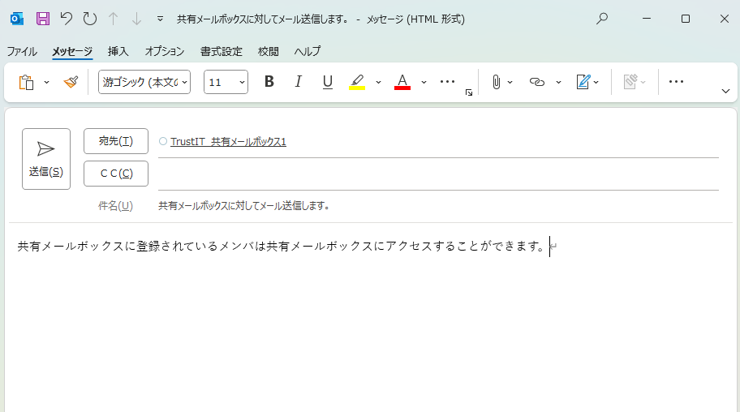
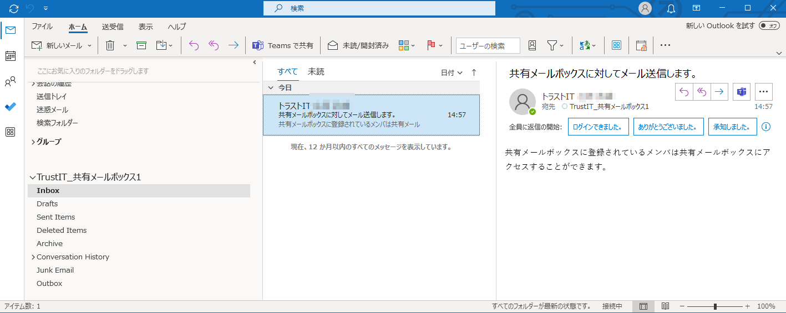

# メーリングリストを用いた各種メール配信の活用

## 内容

- ExchageとOutLookを利用してメーリングリストの活用事例を紹介します。

## 詳細

- [各種グループ作成はこちらを参照](716_M365_10_販売促進デモ一覧291_各種グループ作成方法.md)

### メリット

- **メーリングリストの活用が可能であり、用途に応じて複数の方法の中から選択可能だと理解すること。**

---

## デモサンプル例

### デモ画像

#### 1_配布リストを用いたメーリングリスト送信

---

> [!NOTE]
> 1:配布リストを送信先に設定してメール送信し、登録メンバーがメールを受信する例。

---

#### 2_TeamsとMicrosoft365のグループを用いたメーリングリスト送信

> [!NOTE]
> 2:TeamsとMicrosoft365のグループをを送信先に設定してメール送信し、登録メンバーがメールを受信する例。

---

#### 3_メールが有効なセキュリティグループを用いたメーリングリスト送信

> [!NOTE]
> 3:メールが有効なセキュリティグループを送信先に設定してメール送信し、登録メンバーがメールを受信する例。

#### 4_共有メールボックスを用いたメーリングリスト送信

> [!NOTE]
> 4:共有メールボックスを送信先に設定してメール送信し、登録メンバーがメールを受信する例。

