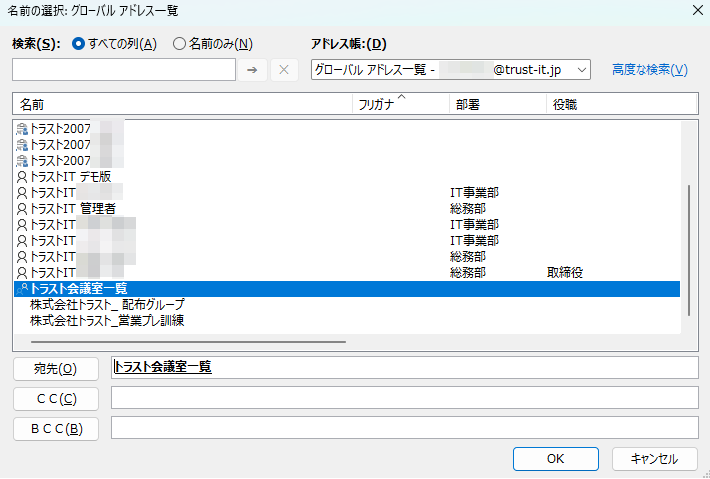

# 会議室と備品を用いた予約管理

## 内容

- ExcahngeとOutLookを利用して会議室と備品を登録し、会議室の予約状況やスケジュール管理の活用事例を紹介します。

## 詳細

### 会議室

- [Outlookを使って空いている会議室を簡単に探したい](https://www.isoroot.jp/blog/5248/)
- [予約または会議をスケジュールする](https://support.microsoft.com/ja-jp/office/%E4%BA%88%E7%B4%84%E3%81%BE%E3%81%9F%E3%81%AF%E4%BC%9A%E8%AD%B0%E3%82%92%E3%82%B9%E3%82%B1%E3%82%B8%E3%83%A5%E3%83%BC%E3%83%AB%E3%81%99%E3%82%8B-1199a77d-caa8-4f99-ac24-dfa5392b6be9)
- 会議室、備品用メールボックス1参考図書265_356
- グループの作成方法参考図書265_358
- 会議予約、案内のTeamsとの連携
- リソースメールボックスは、ライセンスなしのユーザーオブジェクトを関連づけができます。参考図書265_378

### Excahnge Management Shell

- [PowerShellを使用してExchange Onlineに接続する方法1(YouTube)](https://www.youtube.com/watch?v=lfjLgAzeDr4)
- [PowerShellを使用してExchange Onlineに接続する方法2(YouTube)](https://www.youtube.com/watch?v=VPwuS40MlJ4)

### 予定表

- 機能紹介1参考図書265_016
- 予定表のPowerShellでの権限管理参考図書265_374
- 他人に公開、非公開を指定できます。
- 表示方式の切り替えが可能です

- [Outlookの予定表を便利に使ってみよう！共有の手順も解説](https://togeonet.co.jp/post-31779)
- [スケジュール調整が簡単にできる方法](https://schecon.com/article/?p=810)
- [Outlookで予定表を共有する(YouTube)](https://www.youtube.com/watch?v=1x-lk3Jw-cw)

### メリット

- **会議室と備品の登録が可能であり、予約やスケジュール管理にも活用が可能です。**

---

## デモサンプル例

### デモ画像

#### 10_会議室の作成

> [!NOTE]
> 10:管理センターから自社用に8階応接室と4階ミーティングルームの2つの会議室を作成します。

　11:会議室が作成できたことを確認します。

　12:会議室の権限設定を実行します。

　13:下図のように会議室がOutLookから選択できることを確認します。

#### 20_会議室一覧の作成

> [!NOTE]
> 20:管理センターから会議室の一覧を作成します。

　22:会議室一覧は、Exchange管理シェルを使用してのみ作成できるので管理シェルを利用します。(管理センターからの作成はサポート対象外です)

　23:下図を参考にPowerShellを用いて会議室一覧を作成します。

　24:下図のように会議室一覧が作成できていることを確認します。

　25:下図のように会議室一覧がOutLookから選択できることを確認します。

---

#### 30_備品の作成

> [!NOTE]
> 31:管理センターから自社用に備品として、IT事業部共用スマホを作成します。

#### 40_予定表の共有

> [!NOTE]
> 41:メンバ間で予定を共有できるよう、グループまたはメンバを下記のように選択します。

> 42:追加した共有相手に対するアクセス権を下記のように選択します。

> 43:下図のように共有設定が完了した旨のメールを関係者に自動送信していることを確認します。

---

#### 50_会議室を指定して会議予定の作成

> [!NOTE]
> 51:OutLookから新しい会議を作成します。下図のように会議室を指定することで、会議室の予約状況を更新できるようになります。

> 52:下図のように関係者に会議案内のメールが自動送信します。

> 53:手動で会議の承諾、辞退を指定することもできます。

> 54:下図のように、Teamsを用いたWEB会議を実施する場合などは、Teams会議の設定や参加方法の案内を自動でおこなうことができます。

> 55:下図のようにWEB会議で予定を組む場合は、事前に参加者のミュート設定や文字おこしなどの環境設定を指定しておくこともできます。

---

#### 60_会議室の利用状況の確認とダブル予約の回避

> [!NOTE]
> 61:下図のように会議室の空き情報を予定表から確認することができます。

> 62:下図のように既に会議室に予約が入っている時間帯に会議室の予約を実施すると、メールで重複により予約できなかった旨を自動送信します。

#### 70_自分の予定の確認

> [!NOTE]
> 71:下図のように自分の1日の予定を確認することができます。

> 72:下図のように週単位、月単位での予定も確認することができます。

> 73:OutLookの予定表は下図のようにTeamsからも確認することができます。

#### 80_メンバー間の予定の確認

> [!NOTE]
> 81:下図のように自分と関係するメンバの予定も確認することができます。

> 82:下図のようにメンバーのスケジュールの確認方法は自分の好みに合わせて表示を変更することもできます。

## 引用文献

> 参考図書265_356:「ひと目でわかるOffice導入・運用管理編の71ページ、日経BP、2018、平野愛 他  
> 参考図書265_358:「ひと目でわかるOffice導入・運用管理編の91ページ、日経BP、2018、平野愛 他  
> 参考図書265_016:「誰でもできる!Microsoft365導入ガイド」の80ページ、株式会社ネクストセット、2023、村上 宏樹  
> 参考図書265_374:「ひと目でわかるOffice導入・運用管理編の415ページ、日経BP、2018、平野愛 他  
> 参考図書265_378>: 「ひと目でわかるOffice 365メール設定管理編Exchange Server 2016対応版」の77ページ、日経BP、2018、エディフィストラーニング株式会社 飯室 美紀  
