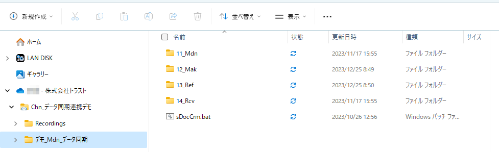
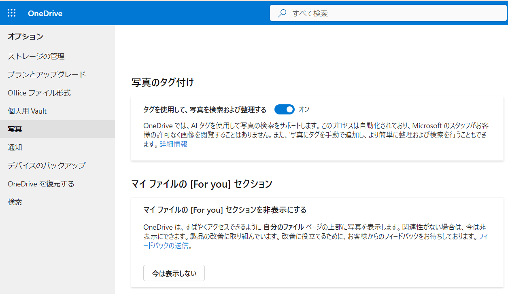

# OneDriveのクラウドストレージ活用例

## 内容

- OneDriveに保存したドキュメントをMicrosoft365の長所を使った活用例を紹介します。
  - 自動バックアップ保存機能
  - パソコンとの自動データ同期
  - 自動バージョン管理

## メリット

> [!IMPORTANT]
>
>- OneDriveを用いたドキュメント管理でも、Microsoft365の多くのアピールポイントを活用できることを理解しましょう。

---

## デモサンプル例

### デモ画像

#### 10_自動バックアップ

> [!NOTE]  
> 10:バックアップするフォルダやファイルを指定することができ、自動で管理することができる。

　　　11:パソコン上でファイルの保存場所を指定しない場合に自動で保存する標準の格納先も自動でバックアップができます。  

　　　12:同期とバックアップ機能を組み合わせることにより、ファイルの保存先を意識しなくても、クラウド上に自動的に保存することが可能です。  

---

#### 20_過去のバージョンへの復元機能とバージョン管理

> [!NOTE]  
> 20:自動でバージョン管理をするため、データを誤って消してしまったときなどに復元することが可能です。

　　　21:過去の変更内容、変更日も確認することができ、スライダーを利用して視覚的に確認しながらの復元も可能です。

---

#### 30_バージョン管理機能

> [!NOTE]  
> 30:OneDriveで保存したデータはバージョン管理することができ、自動、手動のどちらも可能です。

- [OneDriveのバージョン管理機能](716_M365_10_販売促進デモ一覧04_バージョン管理.md#30_OneDrive、Teamsのバージョン管理機能)

---

#### 40_同期機能

> [!NOTE]  
> 40:同期とはクラウドに保存したデータが互いにコピーや更新をし、ローカルPCとクラウド上のデータが同じ状態を自動的に保つことができる機能です。

　　　41:パソコンを起動したとき、バックグランドで自動同期することが可能です。  

　　　42:タスクバーのOneDriveのアイコンから同期状態の確認も可能です。  

---

#### 50_同期機能でクラウドに保存したデータをローカルPCで確認する例

> [!NOTE]  
> 50:OneDriveを開かなくても、クラウドに保存したデータをローカルのパソコン上で確認することが可能です。

　　　51:OneDrive上で保存しているフォルダー  

　　　52:ローカルPC上で同期しているフォルダー  

　　　53:OneDrive上で保存しているファイル一覧  

　　　54:ローカルPC上で同期しているファイル一覧  

　　　55:手動でクラウドとローカルPCのデータを同期することも可能です。  

---

#### 60_ファイルオンデマンドを利用してアイコンによる同期状態の確認

> [!NOTE]  
> 60:一気に全てのデータを同期せずに、都度必要に応じてファイル単位で同期することが可能です。

　　　61:エクスプローラーの状態列のアイコン表示で同期状態の確認が可能です。下図のアイコンは同期していないときに出てくるアイコン。  

　　　62:エクスプローラーの右クリックから手動で同期をおこなうことが可能。。  

　　　63:データが多い場合は同期に少し時間がかかる。下図のアイコンは同期処理中のときに表示するアイコン。  

　　　64:下図のアイコンはOneDrive上とローカルPCの間のフォルダーが同期しているときに表示するアイコン。  

　　　65:下図のアイコンはOneDrive上とローカルPCの間で、ファイル単位で同期しているときの例。  

---

#### 70_Business版とPersonal版の機能差異

> [!NOTE]  
> 70:グループ間を意識した共同作業やセキュリティなどの機能があるため、Personal版とBusiness版には機能の違いがあります。

　　　71:下記は個人が保存した写真のタグ付け管理機能で、Personal版限定の機能です。

　　　72:下記は検索履歴の設定を指定する画面でPersonal版の機能。検索の指定方法にも違いがあります。  

#### 80_OneDriveの検索機能

> [!NOTE]  
> 80:OneDriveでもMicrosoft Search機能を用いた全文検索が可能です。

- [OneDrive上での検索例](716_M365_10_販売促進デモ一覧03_強力な検索機能.md#20_OneDriveの検索(同じアクセス権で検索結果が同じパターン)

---

## 引用文献

> 参考図書265_381:ひと目でわかるOffice 365メール設定管理編Exchange Server 2016対応版」の77ページ、日経BP、2018、エディフィストラーニング株式会社 飯室 美紀