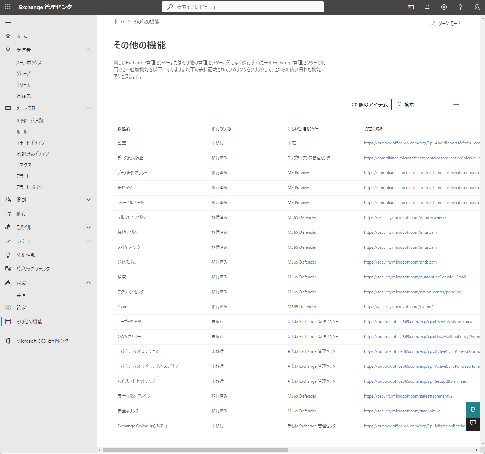

# Exchange Online

## Exchange Online(メールサービス)の代表的な機能とMicrosoft製品との関係性[引用10_41]

|機能|詳細|
|:--|:--|
|機能範囲|メール送受信、アドレス帳、予定表、会議スケジュール、リソース予約、タスク割り当て、その他多数。|
|メール容量|1メールボックスあたり50GB。プランにより100GB|
|スパムおよびマルウェア対策|Exchange Online Protection|
|追加のセキュリティ対策|Microsoft Defender for EndPoint、DLP等。|
|認証|Azure Active Directory|
|管理(WEBコンソール)|画面から操作可能な基本的な管理機能はMicrosoft365管理センターおよびExchange管理センターから操作。|
|管理(PowerShell)|画面から操作不可能な複雑な管理機能はExchange Online PowerShellモジュールおよびCloud Shellで対応。|

### その他機能一部抜粋

その他の機能も多数あり。管理センターの一部を抜粋しています。

## アピールポイント

### コスト削減

- **Microsoft365のライセンスでExchange Onlineメールサービスの利用が可能なため、他社のメールサービスを別料金で支払う必要性がなくコスト削減になります。**
- 自前での準備も不要です。サーバー、ネットワーク機器の準備もいりません。
- 管理コストも削減できます。
  - 高可用性はマイクロソフトが保証
  - 障害発生時はマイクロソフトが復旧作業を実施します
  - バックアップは不要

### Microsoftセキュリティサービスとの高い親和性

#### セキュリティサービス

- [Microsoft365に標準で搭載したメールセキュリティ(Exchange Online Protection）について徹底解説](https://cmss.cybersolutions.co.jp/mail_security/0004)
- [マイクロソフトのセキュリティサービス](716_M365_11_連携02_セキュリティサービス.md)

#### メールサービスのセキュリティの重要性

- [メールが来たらまずは疑うこと！？ウイルス感染の危険性](https://www.ipa.go.jp/security/10threats/ps6vr70000009r3z-att/setsumei_2023_soshiki.pdf)
- メール誤送信による情報漏洩の対策
- [情報セキュリティ10大脅威 2023](https://www.ipa.go.jp/security/10threats/10threats2023.html)

### Microsoft365のその他アプリとの高い親和性

- Exchange Onlineメールサービスを利用することで、Microsoft365のその他アプリとの連携が簡単に実現できます。

## 同一グループのメンバー間での各種連携

### 連絡先

- 機能紹介1参考図書265_018
- 連絡先とプロファイルの検索参考図書265_237

### メール通知

- メールによる通知のためのメール作成と管理参考図書265_224
- Teamsのチャンネルのスレッド(議論等)をメールに送信する参考図書265_268
- Teamsを外部のクラウドストレージと連携参考図書265_269
- Teamsと既存の文書管理システムとの連携参考図書265_270

## 引用文献

> 参考図書265_224:「Microsoft 365 SharePoint運用管理編」の284ページ、日経BP、2021、平野愛  
> 参考図書265_268:「誰も教えてくれなかった!業務効率改善のためのMicrosoft Teams活用術」の142ページ、ダイヤモンド社、2023、山田榮一  
> 参考図書265_270:「誰も教えてくれなかった!業務効率改善のためのMicrosoft Teams活用術」の146ページ、ダイヤモンド社、2023、山田榮一  
> 参考図書265_018:「誰でもできる!Microsoft365導入ガイド」の94ページ、株式会社ネクストセット、2023、村上 宏樹  
> 参考図書265_362:「ひと目でわかるOffice導入・運用管理編の138ページ、日経BP、2018、平野愛他  
> 参考図書265_237:「Microsoft 365 SharePoint運用管理編」の645ページ、日経BP、2021、平野愛  
> [引用10_41]<https://www.youtube.com/watch?v=1j9-h_YrxxQ>